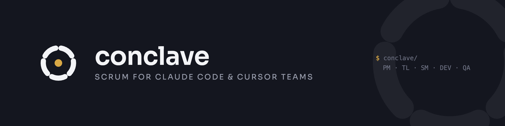

<p align="center">
  
</p>

# Conclave

**Scrum for Claude Code and Cursor teams.**

Conclave is a plugin that brings Scrum methodology to distributed engineering teams. Every Scrum role — Product Manager, Tech Lead, Scrum Master, Developer, QA — gets a specialized AI subagent that helps the human in that role execute their duties. The shared source of truth is plain markdown committed to git inside a visible `conclave/` directory at the root of your project.

This repository ships **two packages** (same `conclave/` contract — [ADR-002](docs/adr/ADR-002-cursor-platform-adaptation.md)):

| Runtime | Package | Install |
|---|---|---|
| **Claude Code** | `conclave` (repo root) | symlink into `~/.claude/plugins/conclave` |
| **Cursor** | `conclave-cursor` (`platforms/cursor/`) | `rsync` into `~/.cursor/plugins/local/conclave-cursor/` |

No central server, no proprietary format, no hidden state. The team coordinates through pull requests. Members can mix Claude Code and Cursor on the same repo.

---

## Install

### Claude Code

```bash
ln -s "$(pwd)" ~/.claude/plugins/conclave
```

Restart Claude Code. You should now see `/conclave-spec` in the slash-command list.

### Cursor

**New to Conclave and using only Cursor?** Follow [Cursor from scratch](#cursor-from-scratch) below.

If you already have this repository checked out:

```bash
./scripts/install-cursor-local.sh
# or: rsync -a --delete platforms/cursor/ ~/.cursor/plugins/local/conclave-cursor/
```

Enable third-party/local plugins if required, then **Developer: Reload Window**. Details and Team/Enterprise caveats: [`platforms/cursor/README.md`](platforms/cursor/README.md).

### Cursor from scratch

Two different directories are involved:

| Directory | What it is |
|---|---|
| **Plugin repo** (`conclave`) | Where you install the Cursor package from — once per machine |
| **Your app repo** | Where `/conclave-spec` creates `conclave/` — once per project |

**1. Get the plugin (once per machine)**

```bash
git clone https://github.com/giolabs/conclave.git
cd conclave
./scripts/install-cursor-local.sh
```

**2. Activate in Cursor**

1. Enable **Include third-party Plugins, Skills, and other configs** if your Cursor build requires it.
2. Run **Developer: Reload Window**.
3. In Agent chat, confirm `/conclave-spec` appears.

On Team/Enterprise, if nothing loads after a correct install, ask your org admin to allow local plugins (`userLocal` may be false).

**3. Bootstrap your project (in your app repo, not the plugin repo)**

```bash
cd /path/to/your-app
```

In Cursor Agent chat:

```text
/conclave-spec
/conclave-planning
```

Then use `/conclave-dev`, `/conclave-qa`, etc. as usual. You do **not** need Claude Code.

---

## Quick start

In your project repo:

```bash
# 1. One-time setup wizard — collects project name, story prefix, stack, launch date,
#    and finds the product document (mvp.md / project.md). No AI agents.
/conclave-spec

# 2. Generate stories + architecture from the product doc and lock Sprint 1 active.
#    Use --all to plan every sprint from the document at once.
/conclave-planning
/conclave-planning --all

# 3. Each dev picks up their assigned story (one story, or several at once)
/conclave-dev US-001
/conclave-dev US-001 US-002 US-003   # parallel — each gets its own branch and PR

# 4. QA verifies stories when they reach review (one or several at once)
/conclave-qa US-001
/conclave-qa US-001 US-002           # parallel — each verified on its own branch

# 5. Tech Lead approves the PR (only in profiles where peer_pr_review is on)
/conclave-pr-review US-001

# Or: run the entire sprint in one shot (steps 3–6 above, automated)
/conclave-sprint

# Headless one-pass — zero prompts, planning defaults, no merge
/conclave-sprint --no-interaction
# Or set commands.sprint.interactive: false in conclave/config.md

# Autonomous /conclave-dev — no prompts, run report appended to the story file (stops at review)
/conclave-dev --no-interaction US-042    # ad-hoc CLI override
# Or set commands.dev.interactive: false in conclave/config.md to make it the default

# Three-Wave Delivery Loop — Dev+CI → QA → Tech Lead, leaves approved PRs for you to merge
/conclave-dev --loop                     # the whole active sprint
/conclave-dev --loop US-042 BUG-004      # or a subset, bugs included
# Recurring weekend window + budgets + Slack: see Scheduling docs / config.template.md

# Mid-sprint story authoring — new, edit, split, retire
/conclave-story new                    # PM authors a new story
/conclave-story edit US-002            # revise a ready story
/conclave-story split US-004           # decompose a story into 2–4 children
/conclave-story retire US-005          # terminal — no LLM call

# Author a Tech Lead ADR
/conclave-adr "Postgres vs Redis for caching"   # topic-directed
/conclave-adr                                    # discovery — TL proposes 1–3 candidates

# Report a bug (post-merge regression) and fix it through the same pipeline
/conclave-bug report "checkout button throws 500 on mobile Safari"
/conclave-bug list                               # the open bug backlog, sorted by severity
/conclave-dev BUG-004                            # reproduces first, then fixes — same as a story
/conclave-qa BUG-004                             # same verification gate as a story

```

`/conclave-spec` is a **one-time wizard** (no AI). It collects project name, story prefix (e.g. `US`, `TASK`, `FEAT`), stack (auto-detected, then confirmed), launch date, and the path to your product planning document (`docs/mvp.md` or `docs/project.md`). It creates the `conclave/` workspace and that's it.

`/conclave-planning` does the rest. On the **first run** it invokes the Tech Lead and Product Manager in parallel — reading the product document — to produce:

- `conclave/product/backlog.md` — Product Backlog with all stories, estimates, and priorities
- `conclave/product/architecture.md` — Architectural Foundation with ADRs
- `conclave/sprints/SPRINT-001/stories/` — per-story files (prefixed with your `story_prefix`)
- `conclave/sprints/SPRINT-001/acceptance/` — per-story Gherkin acceptance criteria

Then (on **every run**) it runs the Sprint Planning ceremony: Scrum Master facilitates, PM validates scope, TL validates feasibility and assigns disciplines. The output:

- Stories assigned to specific devs by discipline
- Definition-of-Ready check per story
- Capacity computed vs commitment
- `conclave/sprints/SPRINT-001/planning.md` — the meeting record
- Sprint status moves from `draft` → `active`

All markdown. All in git. Open it as a PR and let the team review it line by line.

---

## What lives in `conclave/`

```
conclave/
├── README.md                 # explains the directory
├── config.md                 # project type, stack, paths
├── team/
│   ├── roster.md             # who covers which discipline, plus optional PM/SM process roles
│   ├── ceremonies.md         # sprint length, planning day, retro day
│   ├── testing-environments.md # CI env-var/secret NAMES the generated UAT tests read — never real values
│   └── board.md               # branding for conclave-board/ (company name, logo, colors) — no secrets
├── product/                  # persists across sprints
│   ├── backlog.md            # ordered Product Backlog
│   ├── architecture.md       # living architecture doc
│   ├── definition-of-ready.md
│   ├── definition-of-done.md
│   └── bugs/                 # BUG-NNN-<slug>.md — flat, no index file
├── context/                  # frozen snapshots of what fed each spec
└── sprints/
    └── SPRINT-NNN/
        ├── meta.md
        ├── spec.md           # sprint plan
        ├── stories/          # one file per user story
        └── acceptance/       # one file per Gherkin acceptance set
```

---

## Roles and subagents

Every project has six disciplines — Tech Lead, Frontend, Backend, QA, Designer, DevOps — whether or not they map to six different people. Product Manager and Scrum Master are optional **process roles** any discipline-holder can additionally carry, not disciplines themselves.

| Discipline / process role | Conclave subagent | Status |
|---|---|---|
| Tech Lead | `tech-lead` | shipped |
| Frontend | `developer` | shipped |
| Backend | `developer` | shipped |
| QA | `qa` | shipped |
| Designer | `designer` | shipped |
| DevOps | `devops` | shipped |
| Product Manager (process role) | `product-manager` | shipped |
| Scrum Master (process role) | `scrum-master` | shipped |

The subagents are markdown role charters under `skills/conclave/agents/`. Slash commands invoke them by referencing their path in prose, the same pattern `code-review` and `skill-creator` use.

---

## Team profiles — skip what you don't need

Not every team needs every Scrum ceremony. Conclave separates **structural invariants** (sprint planning, acceptance criteria, QA verification, DoD) from **ceremonies the team chooses** (daily standup, backlog grooming, peer PR review, sprint review, retro).

Pick a profile in `conclave/config.md`:

- **`lean`** (default for solo / 2–3-person teams) — only Sprint Planning and QA Verification are enforced. Everything else is silently skippable.
- **`full-scrum`** (default for 4+-person teams) — every ceremony is required.
- **`custom`** — toggle each `ceremonies.*.required` flag individually.

You can change the profile any time by editing `conclave/config.md`. The ceremony commands (`/conclave-standup`, `/conclave-review`, `/conclave-retro`, etc.) read the flags and become silent no-ops when their flag is `false`. The two structural gates (`sprint_planning` and `qa_verification`) cannot be turned off.

### Model configuration (optional)

Assign a specific Claude model to each role subagent. Add a `models:` block to `conclave/config.md`:

```yaml
models:
  default: claude-sonnet-4-6
  overrides:
    tech_lead: claude-opus-4-6      # heavyweight reviews
    developer: claude-haiku-4-5-20251001  # fast bulk dev work
    qa: claude-sonnet-4-6
```

Valid model IDs: `claude-opus-4-6`, `claude-sonnet-4-6`, `claude-haiku-4-5-20251001`. Omit the block entirely to keep today's behavior — every Agent call uses the parent session model.

---

## Shipped so far

- `/conclave-spec` — one-time project setup wizard (no AI agents). Auto-detects the stack, collects project name, story prefix, launch date, team profile, and product document path. Creates the `conclave/` workspace.
- `/conclave-planning [--all]` — generates the full Product Backlog, Architectural Foundation, per-story files, and Gherkin acceptance criteria from the product document (PM + TL in parallel, first run only), then runs the Sprint Planning ceremony and activates the first sprint. `--all` plans every sprint from the document in one pass, activating the first and leaving the rest `draft`.
- `/conclave-dev US-NNN|BUG-NNN [...]` — Developer picks up a story or bug: branches, implements with tests against each Gherkin scenario, opens a PR. Profile-aware peer-review tagging. Multiple IDs run in concurrent batches of ≤ 3. With `--loop` it instead runs the **Three-Wave Delivery Loop** over the active sprint (or the IDs given) — W1 Dev + green CI → W2 QA → W3 forced TL, failures return to W1 — under a recurring schedule and budgets, leaving approved PRs for a human to merge (ADR-006).
- `/conclave-qa US-NNN` — QA verifies a story in `status: review` adversarially: re-derives PASS/FAIL per scenario, probes edge cases, appends a verification report, leaves a PR comment with the verdict. Moves story to `verified` (when TL gate is on) or `done` (when off). **Structurally required — cannot be skipped by any profile.** QA does NOT approve the PR itself. When `conclave/team/testing-environments.md` is configured, QA also generates UAT test artifacts from the story's Gherkin scenarios — a Playwright spec (`frontend`/`multi`), the shared project-wide Postman collection run via Newman (`backend`/`multi`), or a manual functional checklist (`mobile`) — pushes them, and gates the verdict on the target repo's own CI actually running them (never executed locally by QA). A `mobile` checklist awaiting a human produces a distinct `pending_uat` outcome, not a failure.
- `/conclave-pr-review US-NNN` — Tech Lead reviews the code against the architecture, ADRs, and code-level DoD items, then runs `gh pr review --approve` or `--request-changes`. Only runs when `ceremonies.peer_pr_review.required: true`. Story moves from `verified` to `done` on approve.
- `/conclave-board` — one-time scaffold of a local, branded Kanban board (Next.js + shadcn/ui) at `conclave-board/`, a sibling of `conclave/`. Columns mirror the story state machine; cards show ID, title, discipline, assignee, priority, and estimate. A plugin hook regenerates the board's data automatically whenever `conclave/` changes — no CI, no server, no LLM in the update loop. Read-only; never writes back to `conclave/`.

- `/conclave-sprint` — run an entire active sprint end-to-end in one pass: planning → batched Dev → QA → TL PR review (if required). **Headless** (`--no-interaction` / `commands.sprint.interactive: false`) is the same pass with documented planning defaults and zero prompts. Neither mode merges, self-heals, or reads a schedule — unattended delivery is `/conclave-dev --loop` (ADR-006).
- `/conclave-story <new | edit US-NNN | split US-NNN | retire US-NNN>` — Product Manager mid-sprint story authoring, in every team mode. `new` allocates the next monotonic ID and lands the story in backlog (default) or the active sprint; `edit` revises a `ready`/`backlog` story; `split` decomposes a parent into 2–4 children (with a hard scenario-coverage safety rule enforced by the PM subagent); `retire` is a mechanical status change with no LLM call. Introduces the `retired` terminal state — retired stories are excluded from every command's collection queries.
- `/conclave-adr [topic]` — Tech Lead ADR authoring. Topic-directed: `/conclave-adr "<decision>"` researches and writes a standalone ADR at `conclave/product/adr/ADR-NNN-<slug>.md`. Discovery: `/conclave-adr` (no args) has the TL propose 1–3 candidate decisions from sprint activity + architecture gaps, then authors the one the user picks. On first run in a repo with inline ADRs, migrates them to standalone files (atomic per ADR, resumable, idempotent). Every new ADR is `status: proposed`; the team promotes to `accepted` on PR merge.
- `/conclave-bug <report [text|url] | list>` — report a post-merge bug or list the open backlog. `report` turns free text (or a URL/ID from a connected logging/error-tracking MCP tool, detected generically — never a hardcoded vendor) into a `BUG-NNN` artifact with Gherkin repro steps and an explicit `severity`, mirrors it as a GitHub issue, and hands it straight to `/conclave-dev` — bugs are written directly `ready`, skipping Sprint Planning entirely. `list` is mechanical, no LLM call. `/conclave-dev`/`/conclave-qa` accept `BUG-NNN` IDs anywhere they accept `US-NNN`, including mixed batches; the Developer reproduces a bug via its repro steps before fixing it, and the PR includes `Fixes #<issue>` to auto-close the mirrored issue on merge.

### Autonomous mode for `/conclave-dev` (v0.9.0+)

```bash
# Ad-hoc, one-off
/conclave-dev --no-interaction US-042    # or --headless as a synonym

# Repo default — edit conclave/config.md
# commands:
#   dev:
#     interactive: false

# Interactive sprint Phase 2 always uses autonomous Dev (batched)
/conclave-sprint
```

Autonomous mode never calls `AskUserQuestion`. Every prompt site applies a documented default (assignee takeover, branch recreate for stale local branches, branch resume when there is prior story work, refuse when another dev's commits are on the branch); ambiguities without a safe default abort with `AUTONOMOUS_ABORT: <reason>` and reset the story to `status: ready`. Every autonomous run appends a `## Autonomous run — <ISO>` section to the story file with outcome (`done` / `blocked` / `aborted`), decisions taken, files touched, test/lint summary, and blockers if any. It stops at `status: review` and never merges.

### Three-Wave Delivery Loop (v0.15.0+)

```bash
/conclave-dev --loop                           # every non-done story in the active sprint
/conclave-dev --loop US-042 BUG-004            # or a subset, bugs included
/conclave-dev --loop --ignore-schedule US-042  # bypass the window for this run

# Repo default (makes every /conclave-dev run a full three-wave run — prefer the flag):
# commands:
#   dev:
#     loop: true
```

The one autonomous delivery loop in Conclave. It orders the scope by declared `dependencies:` and file overlaps, then runs three ordered waves: **W1 Dev** (implement, push, PR, poll CI to green), **W2 QA** (headless `/conclave-qa`), **W3 Tech Lead** (`/conclave-pr-review`, forced even when peer review is off). A failure in any wave sends the affected stories back to W1 — changed code invalidates the QA verdict that preceded it.

**It never merges.** The run ends with approved PRs listed for a human, each with a copyable merge command. `commands.dev.schedule` is a recurring local-time window (`timezone`, `days`, `start_time`, `end_time`, `duration_days`), `commands.dev.budgets` caps attempts, CI wait, wall clock, and a best-effort token ledger, and the run report at `RUN-NNN-dev-loop.md` carries the ledger plus per-role productivity (dispatches, first-pass success, rework caused, tokens per story). Slack, when enabled, gets a success, partial, or "needs human" message — the last one the moment the blocker happens. Requires the GitHub CLI (`gh`) installed and authenticated with access to the repository. Never closes the sprint (ADR-006).

**Developer walkthrough (weekend campaign)** — full recipe with Slack examples: [Scheduling](https://giolabs.github.io/conclave/en/scheduling). Minimal config:

```yaml
# conclave/config.md
repo:
  integration_branch: develop

commands:
  dev:
    schedule:
      timezone: "America/Argentina/Buenos_Aires"
      days: [fri, sat, sun]
      start_time: "19:00"
      end_time: "07:00"
      duration_days: 3
      active_from: "2026-07-31"
      enforce: true
    budgets:
      max_attempts_per_story: 3
      max_ci_wait_minutes: 20
      max_total_tokens: 2000000
      max_wall_clock_hours: 12

notifications:
  slack:
    enabled: true
    webhook_env: SLACK_WEBHOOK_URL
```

```bash
export SLACK_WEBHOOK_URL="https://hooks.slack.com/services/..."   # env only — never in markdown
gh auth status                                                    # must be able to push + review
/conclave-planning                                                # sprint must be active first
/loop 1h /conclave-dev --loop                                     # Claude Code; or a Cursor Automation / cron

# When Slack says "Ready to merge" (or the run report lists PRs):
gh pr merge 142 --squash --delete-branch
gh pr merge 143 --squash --delete-branch
```

### Headless one-pass `/conclave-sprint`

```bash
/conclave-sprint --no-interaction
# commands.sprint.interactive: false in config.md
```

The same single pass as interactive mode with documented planning defaults and zero prompts. Since 0.15.0 it is **not** a delivery loop: no self-heal, no schedule, no budgets, no merge. Stories it leaves in flight are picked up by `/conclave-dev --loop`. See the docs site **Scheduling** page.

Sprint closeout ceremonies (review, retro) and stack-specific sub-specs are next.

## Roadmap

- `/conclave-standup` — daily standup logger
- `/conclave-review` and `/conclave-retro` — sprint closeout ceremonies
- `/conclave-groom` — backlog grooming
- `/conclave-dev US-NNN` and `/conclave-qa US-NNN` — per-story loops
- `/conclave-substack <stack>` — cascade Sprint spec into backend / frontend / mobile / devops sub-specs
- Jira / Linear MCP integration
- Pre-commit hook to validate artifact structure
- Velocity tracking and burndown chart generation

---

## License

See [LICENSE](LICENSE).
