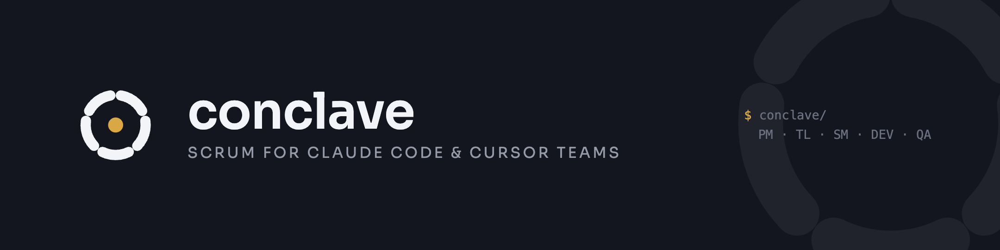

<p align="center">
  
</p>

# Conclave

**Scrum for Claude Code and Cursor teams.**

Conclave is a plugin that brings Scrum methodology to distributed engineering teams. Every Scrum role — Product Manager, Tech Lead, Scrum Master, Developer, QA — gets a specialized AI subagent that helps the human in that role execute their duties. The shared source of truth is plain markdown committed to git inside a visible `conclave/` directory at the root of your project.

This repository ships **two packages** (same `conclave/` contract — [ADR-002](docs/adr/ADR-002-cursor-platform-adaptation.md)):

| Runtime | Package | Install |
|---|---|---|
| **Claude Code** | `conclave` (repo root) | symlink into `~/.claude/plugins/conclave` |
| **Cursor** | `conclave-cursor` (`platforms/cursor/`) | `rsync` into `~/.cursor/plugins/local/conclave-cursor/` |

No central server, no proprietary format, no hidden state. The team coordinates through pull requests. Members can mix Claude Code and Cursor on the same repo.

---

## Install

### Claude Code

```bash
ln -s "$(pwd)" ~/.claude/plugins/conclave
```

Restart Claude Code. You should now see `/conclave-init` in the slash-command list.

### Cursor

**New to Conclave and using only Cursor?** Follow [Cursor from scratch](#cursor-from-scratch) below.

If you already have this repository checked out:

```bash
./scripts/install-cursor-local.sh
# or: rsync -a --delete platforms/cursor/ ~/.cursor/plugins/local/conclave-cursor/
```

Enable third-party/local plugins if required, then **Developer: Reload Window**. Details and Team/Enterprise caveats: [`platforms/cursor/README.md`](platforms/cursor/README.md).

### Cursor from scratch

Two different directories are involved:

| Directory | What it is |
|---|---|
| **Plugin repo** (`conclave`) | Where you install the Cursor package from — once per machine |
| **Your app repo** | Where `/conclave-init` creates `conclave/` — once per project |

**1. Get the plugin (once per machine)**

```bash
git clone https://github.com/giolabs/conclave.git
cd conclave
./scripts/install-cursor-local.sh
```

**2. Activate in Cursor**

1. Enable **Include third-party Plugins, Skills, and other configs** if your Cursor build requires it.
2. Run **Developer: Reload Window**.
3. In Agent chat, confirm `/conclave-init` appears.

On Team/Enterprise, if nothing loads after a correct install, ask your org admin to allow local plugins (`userLocal` may be false).

**3. Bootstrap your project (in your app repo, not the plugin repo)**

```bash
cd /path/to/your-app
```

In Cursor Agent chat:

```text
/conclave-init
/conclave-planning
```

Then use `/conclave-dev`, `/conclave-qa`, etc. as usual. You do **not** need Claude Code.

---

## Quick start

In your project repo:

```bash
# 0. Greenfield, no product doc yet (optional): write the product documentation
#    package to docs/product/ — discovery, tech stack, data model, BLOC, MVP.
#    Or skip it: /conclave-init finds no product doc and offers to run it inline.
/conclave-discovery
/conclave-discovery --from docs/brief.md         # complete an existing, partial document

# 1. Once per repo: setup + inception. Collects project name, story prefix, stack,
#    launch date, profile and sprint length, then turns your product docs (a
#    docs/product/ package, an existing document, or a typed paragraph) into
#    vision + Product Goal, epics, architecture, roadmap.
/conclave-init
/conclave-init --upgrade             # existing v1.x workspace: migrate to v2 instead

# 1b. Release plan: how many sprints, and what goes in each (optional — init already
#     asked; the TL flagged risky epics and the SM scheduled spikes ahead of them).
/conclave-roadmap show
/conclave-roadmap replan --sprints 6   # fit the release into 6 sprints; the rest is listed "beyond the horizon"

# 1c. Knowledge before code, per epic — Epic → Spike → ADR → SPEC → Stories
/conclave-spike "Can Postgres LISTEN/NOTIFY carry our realtime load?" --epic EP-003
/conclave-spec EP-003                  # TL designs the epic from its ADRs (+ missing ADRs), PM checks scope
/conclave-spec approve SPEC-001        # planning now refines EP-003's stories from the SPEC

# 2. Plan the next roadmap slot: refine its epics into stories just in time,
#    size against velocity, assign by discipline, lock the sprint active.
/conclave-planning

# 3. Each dev picks up their assigned story (one story, or several at once)
/conclave-dev US-001
/conclave-dev US-001 US-002 US-003   # parallel — each gets its own branch and PR

# 4. QA verifies stories when they reach review (one or several at once)
/conclave-qa US-001
/conclave-qa US-001 US-002           # parallel — each verified on its own branch

# 5. Tech Lead approves the PR (only in profiles where peer_pr_review is on)
/conclave-pr-review US-001

# 6. Close the sprint: review, optional retro, velocity, roadmap re-plan, reports.
#    Then back to step 2 for the next slot.
/conclave-close

# Or: run the build phase in one shot (planning if needed + steps 3–5, automated)
/conclave-sprint

# Headless one-pass — zero prompts, planning defaults, no merge
/conclave-sprint --no-interaction
# Or set commands.sprint.interactive: false in conclave/config.md

# Autonomous /conclave-dev — no prompts, run report appended to the story file (stops at review)
/conclave-dev --no-interaction US-042    # ad-hoc CLI override
# Or set commands.dev.interactive: false in conclave/config.md to make it the default

# Three-Wave Delivery Loop — Dev+CI → QA → Tech Lead, leaves approved PRs for you to merge
/conclave-dev --loop                     # the whole active sprint
/conclave-dev --loop US-042 BUG-004      # or a subset, bugs included
# Recurring weekend window + budgets + Slack: see Scheduling docs / config.template.md

# Epic authoring after inception — new, edit, split, retire
/conclave-epic new                     # PM writes an epic, SM slots it into the roadmap
/conclave-epic split EP-003            # decompose into 2–4 epics
/conclave-epic retire EP-004           # drop it and its unstarted stories — no LLM call

# Mid-sprint story authoring — new, edit, split, retire
/conclave-story new                    # PM authors a new story
/conclave-story edit US-002            # revise a ready story
/conclave-story split US-004           # decompose a story into 2–4 children
/conclave-story retire US-005          # terminal — no LLM call

# Author a Tech Lead ADR
/conclave-adr "Postgres vs Redis for caching"   # topic-directed
/conclave-adr                                    # discovery — TL proposes 1–3 candidates

# Report a bug (post-merge regression) and fix it through the same pipeline
/conclave-bug report "checkout button throws 500 on mobile Safari"
/conclave-bug list                               # the open bug backlog, sorted by severity
/conclave-dev BUG-004                            # reproduces first, then fixes — same as a story
/conclave-qa BUG-004                             # same verification gate as a story

```

`/conclave-init` runs **once per repo**. After a short setup questionnaire (project name, story prefix, stack auto-detected then confirmed, launch date, team profile, sprint length), it runs **inception**: the Product Manager and Tech Lead work in parallel, then the Scrum Master sequences the result. A finished product document is optional: init scans the repo for product documents, scores them on five coverage signals (problem, users, goal/metrics, features/scope, MVP boundary), and when nothing usable exists offers `/conclave-discovery` — which writes the `docs/product/` package (`00-discovery.md`, `01-tech-stack.md`, `02-data-model.md`, `03-bloc.md`, `04-mvp.md` + `README.md`) outside `conclave/`. A paragraph describing the idea still works for a thinner inception. You confirm a one-screen summary, then it writes:

- `conclave/product/vision.md` — problem, personas, **Product Goal**, success metrics, MVP scope
- `conclave/product/epics/EP-NNN-<slug>.md` — 3–8 epics, each with a success criterion
- `conclave/product/architecture.md` + `product/adr/` — Architectural Foundation and ADRs
- `conclave/product/roadmap.md` — the release plan: how many sprints (auto or a number you set), epics and spikes sequenced into sprint slots, what falls beyond the horizon, and a forecast

Every epic also carries the Tech Lead's risk assessment — `uncertainty`, whether it `needs_spec`, and its open questions. High-uncertainty epics get a timeboxed **spike** scheduled one sprint ahead; epics that change the data model or a public contract get a **SPEC** (`/conclave-spec`) composed from their **ADRs** before their stories are refined.

On a repo with no code yet, the roadmap starts with **Sprint 0** (`SPRINT-000`): a walking skeleton of `type: enabler` stories — scaffold, test framework, lint, CI, `develop` branch.

`/conclave-planning` then plans **one slot at a time**. A readiness gate first checks the slot's epics (approved SPEC where one is needed, spike done or scheduled where uncertainty is high). The PM refines only that slot's epics into INVEST stories with Gherkin acceptance criteria — from the SPEC's story breakdown when there is one — the TL turns spike entries into timeboxed spike stories, the TL checks feasibility and assigns disciplines, and the SM assigns stories and sizes the commitment against the average velocity of the last 3 closed sprints. The sprint moves from `draft` → `active`.

`/conclave-close` ends every sprint: the PM reviews the Increment against the Sprint Goal, the SM runs the retro (when enabled), velocity is recorded, the roadmap forecast is recomputed, and the sprint report, UAT guide and DORA snapshot are written. It is the only command that sets a sprint `closed`, and `/conclave-planning` won't plan the next sprint until it has run.

All markdown. All in git. Open it as a PR and let the team review it line by line.

---

## What lives in `conclave/`

```
conclave/
├── README.md                 # explains the directory
├── config.md                 # project type, stack, profile, sprint cadence
├── team/
│   ├── roster.md             # who covers which discipline, plus optional PM/SM process roles
│   ├── ceremonies.md         # sprint length, planning and close cadence
│   ├── testing-environments.md # CI env-var/secret NAMES the generated UAT tests read — never real values
│   └── board.md               # branding for conclave-board/ (company name, logo, colors) — no secrets
├── product/                  # persists across sprints
│   ├── vision.md             # Product Goal, personas, success metrics
│   ├── roadmap.md            # sprint slots, burnup, forecast, re-plan log
│   ├── epics/                # EP-NNN-<slug>.md
│   ├── backlog.md            # ordered Product Backlog
│   ├── architecture.md       # living architecture doc
│   ├── adr/                  # ADR-NNN-<slug>.md — official ADRs
│   ├── definition-of-ready.md
│   ├── definition-of-done.md
│   └── bugs/                 # BUG-NNN-<slug>.md — flat, no index file
├── context/                  # frozen snapshots of what fed each spec
└── sprints/
    └── SPRINT-NNN/
        ├── meta.md           # status (draft | active | closed), slot, epics, velocity
        ├── spec.md           # sprint plan
        ├── planning.md       # planning record
        ├── review.md         # Sprint Review (/conclave-close)
        ├── retro.md          # Retrospective (/conclave-close, when enabled)
        ├── stories/          # one file per user story (type, epic, discipline, …)
        └── acceptance/       # one file per Gherkin acceptance set
```

The product documentation package written by `/conclave-discovery` lives **outside** `conclave/` — it is the team's own documentation, not Conclave state. `conclave/config.md` `product_doc_path` points at it:

```
docs/product/                 # default; --out changes it
├── README.md                 # index — conclave_product_package: true
├── 00-discovery.md           # problem, ICP, personas, competitors, UVP, features → vision.md
├── 01-tech-stack.md          # choice per layer, rejected alternatives → stack, architecture, ADRs
├── 02-data-model.md          # Mermaid ER, entities → architecture.md
├── 03-bloc.md                # domain invariants, use cases, edge cases → Gherkin at every planning
└── 04-mvp.md                 # Product Goal, metrics, candidate epics, Sprint 0 → vision, epics, roadmap
```

---

## Roles and subagents

Every project has six disciplines — Tech Lead, Frontend, Backend, QA, Designer, DevOps — whether or not they map to six different people. Product Manager and Scrum Master are optional **process roles** any discipline-holder can additionally carry, not disciplines themselves.

| Discipline / process role | Conclave subagent | Status |
|---|---|---|
| Tech Lead | `tech-lead` | shipped |
| Frontend | `developer` | shipped |
| Backend | `developer` | shipped |
| QA | `qa` | shipped |
| Designer | `designer` | shipped |
| DevOps | `devops` | shipped |
| Product Manager (process role) | `product-manager` | shipped |
| Scrum Master (process role) | `scrum-master` | shipped |

The subagents are markdown role charters under `skills/conclave/agents/`. Slash commands invoke them by referencing their path in prose, the same pattern `code-review` and `skill-creator` use.

---

## Team profiles — skip what you don't need

Conclave separates **structural gates** from **optional gates**. Three gates are always on, in every profile:

- **Sprint Planning** (`/conclave-planning`) — no sprint without a locked goal and story list.
- **QA Verification** (`/conclave-qa`) — every `done` story carries a verification report.
- **Sprint Review** (inside `/conclave-close`) — the sprint never closes, and the next one can't be planned, without inspecting the Increment.

Two gates are optional and set by the profile in `conclave/config.md`:

| Profile | Tech Lead PR approval (`ceremonies.peer_pr_review.required`) | Retro inside `/conclave-close` (`ceremonies.close.retro`) |
|---|---|---|
| **`lean`** (solo / small teams) | off | off |
| **`full-scrum`** | on | on |
| **`custom`** | you set it | you set it |

There are no standup, grooming, review or retro commands: the board and story statuses are the daily view, refinement happens inside `/conclave-planning`, and review + retro are parts of `/conclave-close`. `sprint.length_weeks` sets the cadence and `sprint.sprint_zero` toggles the walking-skeleton Sprint 0.

v2.0.0 removed `ceremonies.daily_standup`, `backlog_grooming`, `sprint_review` and `sprint_retrospective`; commands warn once and ignore them, and `/conclave-init --upgrade` migrates them.

### Model configuration (optional)

Assign a specific Claude model to each role subagent. Add a `models:` block to `conclave/config.md`:

```yaml
models:
  default: claude-sonnet-4-6
  overrides:
    tech_lead: claude-opus-4-6      # heavyweight reviews
    developer: claude-haiku-4-5-20251001  # fast bulk dev work
    qa: claude-sonnet-4-6
```

Valid model IDs: `claude-opus-4-6`, `claude-sonnet-4-6`, `claude-haiku-4-5-20251001`. Omit the block entirely to keep today's behavior — every Agent call uses the parent session model.

---

## Shipped so far

- `/conclave-discovery [idea] [--from <path>] [--out <dir>]` — optional, before inception: turns a raw idea (or an incomplete document) into the product documentation package under `docs/product/` (team-owned, outside `conclave/`). Haiku competitor research, PM discovery with one ICP/problem/UVP checkpoint, TL tech stack + data model + BLOC (domain rules), PM MVP with candidate epics, Sprint 0 and sequencing. No stakeholder questionnaire — unknowns become open questions. `/conclave-init` offers it automatically when it finds no usable product document; `/conclave-planning` reads `03-bloc.md` at every planning to derive Gherkin scenarios.
- `/conclave-init [--upgrade]` — one-time project setup plus **inception**. Auto-detects the stack, collects project name, story prefix, launch date, team profile and sprint length, then PM + TL (parallel) and SM produce `vision.md` (Product Goal), epics, architecture + ADRs, and a sprint-by-sprint `roadmap.md` (Sprint 0 walking skeleton first on greenfield). The product document is optional — init scores what it finds and offers `/conclave-discovery` when nothing usable exists; a `docs/product/` package pre-fills the stack and supplies the epics. `--upgrade` migrates a v1.x workspace in place (config, sprint statuses, epics derived from existing stories, roadmap seeded from past velocity).
- `/conclave-planning` — Sprint Planning for the next roadmap slot, in three waves: PM refines the slot's epics into stories with Gherkin acceptance criteria (TL writes enabler stories), TL checks feasibility and assigns disciplines, SM assigns and sizes the commitment against real velocity (fixed formula until the first sprint closes). Imports carry-over and open retro actions. Refuses while a sprint is still active. `--all` was removed in v2.0.0.
- `/conclave-dev US-NNN|BUG-NNN [...]` — Developer picks up a story or bug: branches, implements with tests against each Gherkin scenario, opens a PR. Profile-aware peer-review tagging. Multiple IDs run in concurrent batches of ≤ 3. With `--loop` it instead runs the **Three-Wave Delivery Loop** over the active sprint (or the IDs given) — W1 Dev + green CI → W2 QA → W3 forced TL, failures return to W1 — under a recurring schedule and budgets, leaving approved PRs for a human to merge (ADR-006).
- `/conclave-qa US-NNN` — QA verifies a story in `status: review` adversarially: re-derives PASS/FAIL per scenario, probes edge cases, appends a verification report, leaves a PR comment with the verdict. Moves story to `verified` (when TL gate is on) or `done` (when off). **Structurally required — cannot be skipped by any profile.** QA does NOT approve the PR itself. When `conclave/team/testing-environments.md` is configured, QA also generates UAT test artifacts from the story's Gherkin scenarios — a Playwright spec (`frontend`/`multi`), the shared project-wide Postman collection run via Newman (`backend`/`multi`), or a manual functional checklist (`mobile`) — pushes them, and gates the verdict on the target repo's own CI actually running them (never executed locally by QA). A `mobile` checklist awaiting a human produces a distinct `pending_uat` outcome, not a failure.
- `/conclave-pr-review US-NNN` — Tech Lead reviews the code against the architecture, ADRs, and code-level DoD items, then runs `gh pr review --approve` or `--request-changes`. Only runs when `ceremonies.peer_pr_review.required: true`. Story moves from `verified` to `done` on approve.
- `/conclave-board` — one-time scaffold of a local, branded Kanban board (Next.js + shadcn/ui) at `conclave-board/`, a sibling of `conclave/`. Columns mirror the story state machine; cards show ID, title, discipline, assignee, priority, and estimate. A plugin hook regenerates the board's data automatically whenever `conclave/` changes — no CI, no server, no LLM in the update loop. Read-only; never writes back to `conclave/`.

- `/conclave-close` — closes the active sprint: critical-bug gate, unfinished-story decisions, PM Sprint Review (`review.md`: Sprint Goal verdict, epic and Product Goal progress), SM retro when `ceremonies.close.retro: true` (`retro.md`, ≤ 3 action items), velocity, roadmap burnup and forecast, plus `report.md`, `UAT.md` and `dora-data.yml`. The only command that sets a sprint `closed`.
- `/conclave-roadmap <show | replan [--sprints N|auto]>` — release planning: how many sprints the release has and what goes in each. `show` prints the release plan (MVP slot, launch risk, spikes, epics beyond the horizon); `replan` has the Scrum Master re-sequence every future slot against a fixed number of sprints or as many as the must/should epics need. Never touches active or closed sprints.
- `/conclave-spike "<question>" [--epic EP-NNN] [--timebox XS|S|M]` — a timeboxed `type: spike` story that answers one question. The Tech Lead runs it through `/conclave-dev` and writes a findings report plus the declared outputs (a proposed ADR, a draft SPEC, re-estimates) in a docs-only PR; QA verifies the deliverable; `/conclave-close` feeds the findings back into the epic.
- `/conclave-spec <EP-NNN | approve SPEC-NNN>` — the technical specification of an epic (`conclave/product/specs/SPEC-NNN-<slug>.md`): decisions (ADRs, writing missing ones as proposed), design, contracts, data changes, domain rules, test strategy, rollout and a story breakdown, scope-checked by the PM. Once approved, `/conclave-planning` refines the epic's stories from it.
- `/conclave-epic <new | edit EP-NNN | split EP-NNN | retire EP-NNN>` — Product Manager epic authoring after inception; the Tech Lead adds the risk assessment and the Scrum Master re-slots the roadmap. `retire` is mechanical and also retires the epic's unstarted stories.
- `/conclave-sprint` — run the build phase of a sprint in one pass: planning (if no sprint is active) → batched Dev → QA → TL PR review (if required). Closing stays with `/conclave-close`. **Headless** (`--no-interaction` / `commands.sprint.interactive: false`) is the same pass with documented planning defaults and zero prompts. Neither mode merges, self-heals, or reads a schedule — unattended delivery is `/conclave-dev --loop` (ADR-006).
- `/conclave-story <new | edit US-NNN | split US-NNN | retire US-NNN>` — Product Manager mid-sprint story authoring, in every team mode. `new` allocates the next monotonic ID, links it to an epic (`epic:`) and a `type` (`feature | enabler`), and lands the story in backlog (default) or the active sprint; `edit` revises a `ready`/`backlog` story; `split` decomposes a parent into 2–4 children (with a hard scenario-coverage safety rule enforced by the PM subagent); `retire` is a mechanical status change with no LLM call. Introduces the `retired` terminal state — retired stories are excluded from every command's collection queries.
- `/conclave-adr [topic]` — Tech Lead ADR authoring. Topic-directed: `/conclave-adr "<decision>"` researches and writes a standalone ADR at `conclave/product/adr/ADR-NNN-<slug>.md`. Discovery: `/conclave-adr` (no args) has the TL propose 1–3 candidate decisions from sprint activity + architecture gaps, then authors the one the user picks. On first run in a repo with inline ADRs, migrates them to standalone files (atomic per ADR, resumable, idempotent). Every new ADR is `status: proposed`; the team promotes to `accepted` on PR merge.
- `/conclave-bug <report [text|url] | list>` — report a post-merge bug or list the open backlog. `report` turns free text (or a URL/ID from a connected logging/error-tracking MCP tool, detected generically — never a hardcoded vendor) into a `BUG-NNN` artifact with Gherkin repro steps and an explicit `severity`, mirrors it as a GitHub issue, and hands it straight to `/conclave-dev` — bugs are written directly `ready`, skipping Sprint Planning entirely. `list` is mechanical, no LLM call. `/conclave-dev`/`/conclave-qa` accept `BUG-NNN` IDs anywhere they accept `US-NNN`, including mixed batches; the Developer reproduces a bug via its repro steps before fixing it, and the PR includes `Fixes #<issue>` to auto-close the mirrored issue on merge.

### Autonomous mode for `/conclave-dev` (v0.9.0+)

```bash
# Ad-hoc, one-off
/conclave-dev --no-interaction US-042    # or --headless as a synonym

# Repo default — edit conclave/config.md
# commands:
#   dev:
#     interactive: false

# Interactive sprint Phase 2 always uses autonomous Dev (batched)
/conclave-sprint
```

Autonomous mode never calls `AskUserQuestion`. Every prompt site applies a documented default (assignee takeover, branch recreate for stale local branches, branch resume when there is prior story work, refuse when another dev's commits are on the branch); ambiguities without a safe default abort with `AUTONOMOUS_ABORT: <reason>` and reset the story to `status: ready`. Every autonomous run appends a `## Autonomous run — <ISO>` section to the story file with outcome (`done` / `blocked` / `aborted`), decisions taken, files touched, test/lint summary, and blockers if any. It stops at `status: review` and never merges.

### Three-Wave Delivery Loop (v0.15.0+)

```bash
/conclave-dev --loop                           # every non-done story in the active sprint
/conclave-dev --loop US-042 BUG-004            # or a subset, bugs included
/conclave-dev --loop --ignore-schedule US-042  # bypass the window for this run

# Repo default (makes every /conclave-dev run a full three-wave run — prefer the flag):
# commands:
#   dev:
#     loop: true
```

The one autonomous delivery loop in Conclave. It orders the scope by declared `dependencies:` and file overlaps, then runs three ordered waves: **W1 Dev** (implement, push, PR, poll CI to green), **W2 QA** (headless `/conclave-qa`), **W3 Tech Lead** (`/conclave-pr-review`, forced even when peer review is off). A failure in any wave sends the affected stories back to W1 — changed code invalidates the QA verdict that preceded it.

**It never merges.** The run ends with approved PRs listed for a human, each with a copyable merge command. `commands.dev.schedule` is a recurring local-time window (`timezone`, `days`, `start_time`, `end_time`, `duration_days`), `commands.dev.budgets` caps attempts, CI wait, wall clock, and a best-effort token ledger, and the run report at `RUN-NNN-dev-loop.md` carries the ledger plus per-role productivity (dispatches, first-pass success, rework caused, tokens per story). Slack, when enabled, gets a success, partial, or "needs human" message — the last one the moment the blocker happens. Requires the GitHub CLI (`gh`) installed and authenticated with access to the repository. Never closes the sprint (ADR-006).

**Developer walkthrough (weekend campaign)** — full recipe with Slack examples: [Scheduling](https://giolabs.github.io/conclave/en/scheduling). Minimal config:

```yaml
# conclave/config.md
repo:
  integration_branch: develop

commands:
  dev:
    schedule:
      timezone: "America/Argentina/Buenos_Aires"
      days: [fri, sat, sun]
      start_time: "19:00"
      end_time: "07:00"
      duration_days: 3
      active_from: "2026-07-31"
      enforce: true
    budgets:
      max_attempts_per_story: 3
      max_ci_wait_minutes: 20
      max_total_tokens: 2000000
      max_wall_clock_hours: 12

notifications:
  slack:
    enabled: true
    webhook_env: SLACK_WEBHOOK_URL
```

```bash
export SLACK_WEBHOOK_URL="https://hooks.slack.com/services/..."   # env only — never in markdown
gh auth status                                                    # must be able to push + review
/conclave-planning                                                # sprint must be active first
/loop 1h /conclave-dev --loop                                     # Claude Code; or a Cursor Automation / cron

# When Slack says "Ready to merge" (or the run report lists PRs):
gh pr merge 142 --squash --delete-branch
gh pr merge 143 --squash --delete-branch
```

### Headless one-pass `/conclave-sprint`

```bash
/conclave-sprint --no-interaction
# commands.sprint.interactive: false in config.md
```

The same single pass as interactive mode with documented planning defaults and zero prompts. Since 0.15.0 it is **not** a delivery loop: no self-heal, no schedule, no budgets, no merge. Stories it leaves in flight are picked up by `/conclave-dev --loop`. See the docs site **Scheduling** page.

Stack-specific sub-specs are next.

## Roadmap

- `/conclave-substack <stack>` — cascade Sprint spec into backend / frontend / mobile / devops sub-specs
- Jira / Linear MCP integration
- Pre-commit hook to validate artifact structure
- Burnup / burndown chart rendering on the board (velocity and burnup data already live in `roadmap.md`)

---

## License

See [LICENSE](LICENSE).
