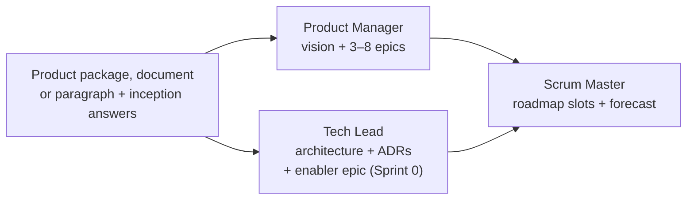

# /conclave-init [--upgrade]

One-time project setup **and inception**. Run it **once per repository**, before `/conclave-planning`.

```
/conclave-init             # new workspace: setup + inception
/conclave-init --upgrade   # existing v1.x workspace: migrate to the v2 structure
```

It creates the `conclave/` workspace, records the configuration every other command reads, and produces the four artifacts the rest of the Scrum cycle hangs from:

| Artifact | Owner | Purpose |
|---|---|---|
| `product/vision.md` | Product Manager | Problem, personas, **Product Goal**, success metrics, MVP scope |
| `product/epics/EP-NNN-<slug>.md` | Product Manager | The big chunks of value, each with a success criterion |
| `product/architecture.md` + `product/adr/` | Tech Lead | Architectural foundation and the enablers the walking skeleton needs |
| `product/roadmap.md` | Scrum Master | Epics sequenced into sprint slots up to the MVP / launch date |

No product document yet? Step 3 offers [`/conclave-discovery`](/en/commands/discovery) and runs it inline — or run it yourself first.

**Stories are not written here.** They are refined just in time, one roadmap slot at a time, by [`/conclave-planning`](/en/commands/planning).

## What it does

### Step 0 — Guard idempotency and pick the mode

If `conclave/config.md` already exists, the command reads its `conclave_version`:

| Mode | Existing version | Result |
|---|---|---|
| no flag | `< 2.0.0` or absent | Stops: run `/conclave-init --upgrade` to migrate. |
| no flag | `>= 2.0.0` | Stops: already initialized — edit `config.md`, run `/conclave-planning`. |
| `--upgrade` | `< 2.0.0` | Runs the [upgrade path](#upgrade-path---upgrade). |
| `--upgrade` | `>= 2.0.0` | Stops: already on v2. |

`--upgrade` with no `config.md` at all stops and tells you to run `/conclave-init` without the flag. If the current directory is not a git repo, it asks whether to run `git init`.

### Step 1 — Detect the stack

Before asking anything, the command scans up to 3 directory levels deep for signal files:

| Signal file | Likely stack |
|---|---|
| `package.json` + `next.config.*` | Next.js |
| `package.json` (no framework config) | Node.js |
| `pubspec.yaml` | Flutter / Dart |
| `go.mod` | Go |
| `Cargo.toml` | Rust |
| `requirements.txt` / `pyproject.toml` | Python |
| `build.gradle` / `pom.xml` | Android / Java / Kotlin |
| `Gemfile` | Ruby on Rails |
| `mix.exs` | Elixir |
| `composer.json` | PHP |

### Step 2 — Collect project info

One `AskUserQuestion` call collects:

1. **Project name** — the title in all generated artifacts.
2. **Story ID prefix** — default `US`. Stories are named `<PREFIX>-001`, `<PREFIX>-002`, …
3. **Project language** — ISO 639-1 code (default `es`). All generated markdown is written in it.
4. **Launch date** — ISO date or `TBD`.
5. **Team mode** — `team` or `solo` (solo forces `lean`).
6. **Team profile** (team mode only) — `lean` (TL gate and retro off), `full-scrum` (TL PR approval gate on, retro on inside `/conclave-close`), or `custom`.
7. **Sprint length** — 1, 2 (recommended), 3, or 4 weeks. Stored as `sprint.length_weeks`.

### Step 3 — Product documentation

Inception needs to know what the product is, for whom, and what the MVP is. This step finds the team's product documentation, checks it covers what inception needs, and — when there is none — offers [`/conclave-discovery`](/en/commands/discovery) to write it. A finished document is welcome but **not required**.

**3.1 — Scan the repo (no agent).** First it looks for a [`/conclave-discovery`](/en/commands/discovery) package: a `README.md` under a `docs` path with `conclave_product_package: true` in its frontmatter (default `docs/product/`). A package wins over everything else. Otherwise it lists every `.md` up to depth 4 — excluding `.git/`, `node_modules/`, `vendor/`, `dist/`, `build/`, `conclave/`, `conclave-board/`, `.github/`, `site/` and `CHANGELOG.md`, `LICENSE*`, `CODE_OF_CONDUCT.md`, `CONTRIBUTING.md`, `SECURITY.md`, `CLAUDE.md` — and scores each one by reading its first ~200 lines:

| Signal | Points |
|---|---|
| Under `docs/` (or `doc/`, `product/`) | +2 |
| Filename contains `mvp`, `product`, `prd`, `vision`, `discovery`, `brief`, `idea`, `project`, `spec`, `requirements` | +3 |
| Each coverage signal present (below) | +2 |
| Root `README.md` | −2 (usually install docs, not product) |

The five **coverage signals** are what inception needs, matched on headings or obvious paragraphs in English or Spanish:

| Signal | Matches |
|---|---|
| Problem | problem, pain, problema, dolor |
| Users | user, persona, ICP, customer, usuario, cliente |
| Goal / metrics | goal, objective, metric, KPI, success, objetivo, métrica, éxito |
| Features / scope | feature, scope, functionality, funcionalidad, alcance, requisitos |
| MVP boundary | MVP, out of scope, fuera de alcance, v1, release |

Candidates scoring ≥ 4 are kept, top 3 by score, each with its missing signals.

**3.2 — Choose the source.** One question, shaped by what the scan found:

| Case | Options |
|---|---|
| **A.** A discovery package was found | **Use it** (recommended) · **Regenerate with /conclave-discovery** · **Use something else** |
| **B.** Candidates were found | One option per candidate (`<path>` — covers N/5, missing: …) · **None of these — write it with /conclave-discovery** · **I'll describe the idea in a paragraph** |
| **C.** Nothing was found | **Create it with /conclave-discovery** (recommended; about 10–15 minutes) · **I'll describe the idea in a paragraph** (faster, thinner inception — the PM fills gaps and lists open questions) · **I have a document elsewhere** (a path, verified to exist) |

**3.3 — Gap check.** A chosen document that covers **fewer than 4 of the 5** signals gets one more question: **Complete it with `/conclave-discovery --from <path>`** (recommended — keeps everything the document says, fills the gaps, writes the package to `docs/product/`) or **Use it as is** (the PM lists what is missing as open questions in `vision.md`).

**3.4 — Inline discovery.** When any answer chose `/conclave-discovery`, its Steps 1–7 run right here — with `--from` when completing a document, the project language from Step 2, and the team size from the team mode — and control returns to init with the new package as the source.

**3.5 — Inputs.** The result sets `product_doc_path`:

- **Package** → the package folder; inception reads all five documents.
- **Document** → its path; inception reads its content.
- **Paragraph** → `""`; the text you type is saved verbatim to `conclave/context/idea.md`.

### Step 4 — Confirm the stack and inception preferences

**4.1 — Stack.** One question shows the stack (language, framework, datastore, infrastructure) with where each value came from. Defaults, in order: the signal files from Step 1; when nothing was detected, the `stack:` frontmatter of the package's `01-tech-stack.md` ("from docs/product/01-tech-stack.md"). If both exist and disagree, both are shown and the detected one is recommended — the code is the fact. Confirm or correct per field.

Step 1 also decides whether the repo is **greenfield** (no application code yet): that sets the default for `sprint.sprint_zero` and tells the Tech Lead the architecture is a proposal for an empty repo.

**4.2 — Inception preferences.** A short, optional round asks only what the source does not already answer: primary users, a Product Goal hint, hard constraints — all three skipped for a discovery package — and whether to **start with a walking-skeleton Sprint 0** (default yes on greenfield or when the package's `04-mvp.md` lists Sprint 0 enablers).

### Step 5 — Create the workspace skeleton

Writes `config.md`, `team/roster.md`, `team/ceremonies.md`, DoR/DoD, `conclave/README.md`, the GitHub PR/issue templates (only if missing), and the context snapshots.

### Steps 6–7 — Inception (three role subagents)



- **Wave 1 (parallel)** — the Product Manager writes the vision and 3–8 feature epics ordered by value (from a discovery package, the `04-mvp.md` candidate epics *are* the epics); the Tech Lead writes the architectural foundation, the initial ADRs and, when Sprint 0 is on, a "Walking skeleton" enabler epic (scaffold, test framework with one passing test, lint, CI, `develop` integration branch). On greenfield, every ADR's evidence comes from versioned docs, and the ADR says so. From a discovery package, `01-tech-stack.md` is the starting point: each choice becomes an ADR (its rejected alternatives become the alternatives considered), and `02-data-model.md` / `03-bloc.md` feed the architecture overview.
- **Wave 2** — the Scrum Master sequences the epics into sprint slots using team size, sprint length and launch date, and states where the MVP lands.

### Step 8 — Checkpoint

You see a compact summary before anything is written:

```
Product Goal:  <one sentence>
Personas:      <names>
Epics:         EP-001 <title> [M, must] · EP-002 <title> [S, should] · …
Roadmap:       S0 walking skeleton · S1 EP-001 · S2 EP-001, EP-002 · … MVP at SPRINT-00N (<date>)
Launch risk:   <on track | at risk — reason>
```

Accept it, or describe a change in free text: only the affected agent re-runs (the roadmap always re-runs when epics change). After three rounds the command writes what exists and tells you to edit the files directly.

### Step 9 — Write inception artifacts

Vision, epics (numbered from `EP-001`, enabler epic first), architecture and standalone ADRs, roadmap, and an **empty** `product/backlog.md` — stories arrive at planning.

## What it creates

```
conclave/
├── README.md
├── config.md                         # project, stack, profile, sprint cadence
├── team/
│   ├── roster.md
│   ├── ceremonies.md
│   ├── PR_REVIEW_TEMPLATE.md
│   └── testing-environments.md
├── product/
│   ├── vision.md                     # Product Goal, personas, success metrics, MVP scope
│   ├── roadmap.md                    # sprint slots, burnup, forecast, re-plan log
│   ├── epics/EP-NNN-<slug>.md
│   ├── architecture.md
│   ├── adr/ADR-NNN-<slug>.md
│   ├── backlog.md                    # empty table — filled by /conclave-planning
│   ├── definition-of-ready.md
│   └── definition-of-done.md
├── context/                          # snapshots (+ idea.md when the idea was typed)
├── sprints/
├── runs/
└── report/
.github/
├── ISSUE_TEMPLATE/bug_report.md      # only if it doesn't already exist
└── PULL_REQUEST_TEMPLATE.md          # only if it doesn't already exist
```

## Upgrade path (`--upgrade`)

Migrates a v1.x workspace in place. **Append, don't clobber**: existing sprints, stories, acceptance files and reports are never rewritten beyond the frontmatter fields listed below, and nothing is deleted or renamed. Every sub-step is idempotent, so a re-run after a partial failure resumes.

1. **Inventory** — prints sprints by status, story count, inline ADR count.
2. **Config** — removes `ceremonies.daily_standup`, `backlog_grooming`, `sprint_review`; maps `sprint_retrospective.required` → `ceremonies.close.retro`; adds `sprint.length_weeks` (from `team/ceremonies.md`, default 2) and `sprint.sprint_zero: false`; sets `conclave_version: "2.0.0"`. You see the diff and confirm before it is written.
3. **Sprint status** — v1 `done` / `archived` become `closed`; `slot`, `epics`, `committed_units`, `velocity` (sum of `done` story estimates), `sprint_goal_met`, `closed_at` are added where missing.
4. **Inception from what exists** — the Product Manager groups every non-retired story into exactly one epic and writes `vision.md`; the Tech Lead step is skipped (your `architecture.md` stays); the Scrum Master builds a roadmap where closed sprints are `closed` slots, the active sprint is the `active` slot, and the burnup is seeded from past velocities.
5. **Story frontmatter** — adds `type: feature` and `epic: EP-NNN` where missing. Nothing else changes.
6. **Backlog** — adds the `Epic` column and replaces the old `## Vision` section with a link to `vision.md`.

If `architecture.md` still has inline `### ADR-NNN:` sections, run [`/conclave-adr`](/en/commands/adr) once to migrate them. See [Upgrading from v1](/en/upgrade) for the full checklist.

## Guardrails

- Writes only inside `conclave/` and `.github/` (and only `.github/` files that don't exist yet).
- Writes the discovery package folder (default `docs/product/`) only when you chose `/conclave-discovery` in Step 3.
- Does not commit and does not create branches — the integration branch is an enabler story in Sprint 0.
- Does not write stories.
- Never overwrites an existing `config.md` outside `--upgrade`.

## After it runs

```bash
git add conclave/ .github/
git commit -m "conclave: inception for <project_name>"

/conclave-planning      # plans the first slot (Sprint 0 when enabled)
```
