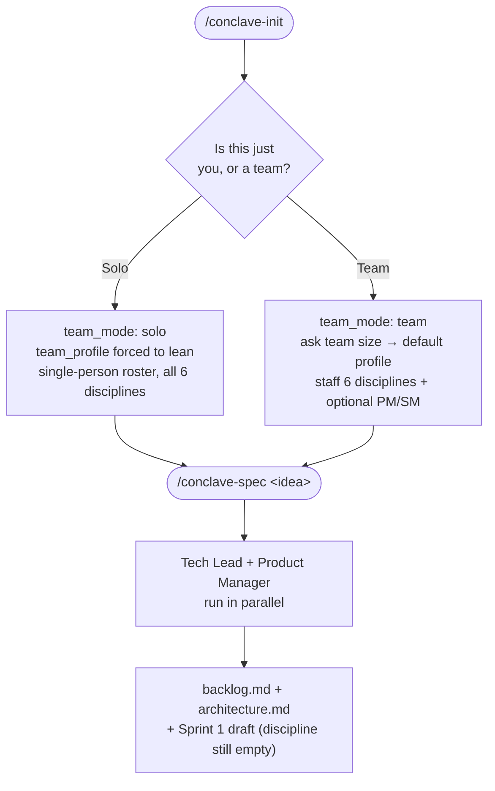
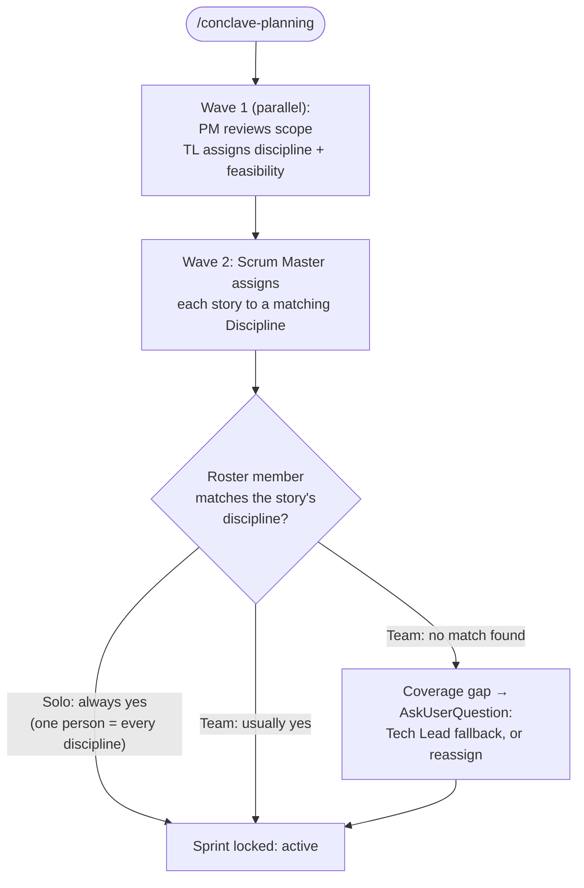
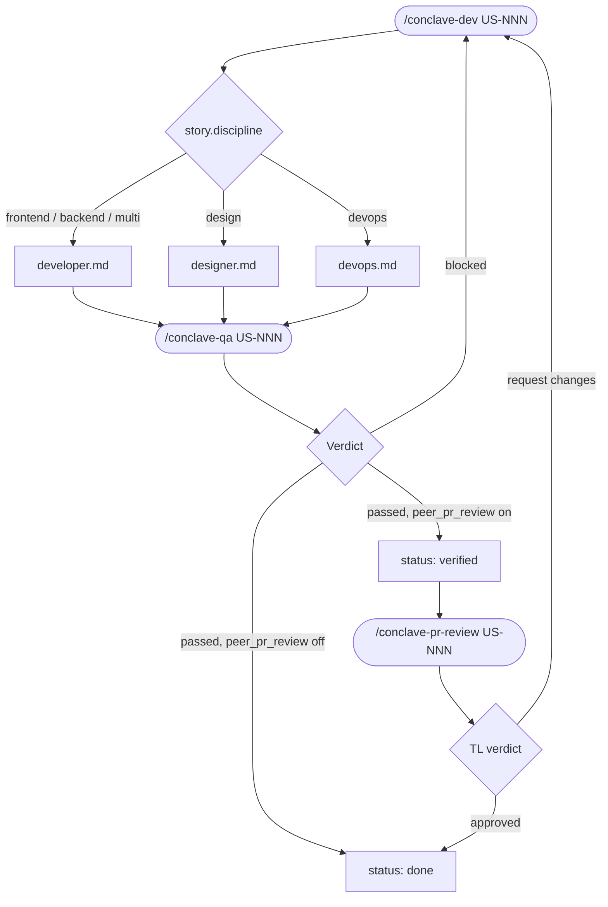

# Workflow map

Conclave runs the exact same six commands whether you're solo or a team — what changes is how much each command asks, and how assignment works. This page maps the full loop end to end, branching where solo and team actually differ.

## Day 0 — bootstrap and founding artifacts

Solo and team run the identical `/conclave-spec` step — the branch only changes what `/conclave-init` asked and how `roster.md` looks afterward.

## Sprint Planning — where solo and team diverge most

On a solo project, the discipline-match check in Wave 2 never produces a coverage gap — the single roster row lists every discipline, so the Scrum Master always finds a match. On a team, an unstaffed discipline (`TBD` in the roster) or a genuinely uncovered one triggers the gap prompt.

## Per-story delivery loop — identical after that

`peer_pr_review.required` is normally `false` in `lean` (the solo default), so a solo run typically skips the `/conclave-pr-review` step entirely — QA's pass goes straight to `done`. A team on `full-scrum` always routes through both gates.

## Solo vs. team, side by side

| Step | Solo | Team |
|---|---|---|
| `/conclave-init` questions | Project name, type, sprint length, timezone. No profile question — `lean` is forced. | Same, plus team size (defaults the profile), and one question per discipline to staff the roster. |
| Roster shape | One row, `Discipline` = all six, `Process role(s)` = PM, SM. | One row per discipline (or per person, if someone covers several), `TBD` for anything unstaffed. |
| `/conclave-spec` | Identical — Tech Lead and Product Manager still run as two separate subagents in parallel, even though a human might be doing both jobs. | Identical. |
| `/conclave-planning` Wave 2 (assignment) | Always finds a match; coverage gaps cannot happen. | Can hit a coverage gap if a discipline is `TBD` or a story needs one nobody covers — resolved via `AskUserQuestion`. |
| `/conclave-dev` discipline routing | Same routing table (`developer.md` / `designer.md` / `devops.md`) — the charter run depends on the story, not on who's running it. | Identical. |
| `/conclave-pr-review` | Skipped by default (`peer_pr_review.required: false` under `lean`). QA's pass alone reaches `done`. | Runs when `peer_pr_review.required: true` (the `full-scrum` default) — a second, code-level gate before `done`. |

The takeaway: **the six commands and the discipline model never change.** What changes is purely `conclave/config.md`'s `team_mode` and `team_profile` values, and how many humans are behind the roster's rows.

