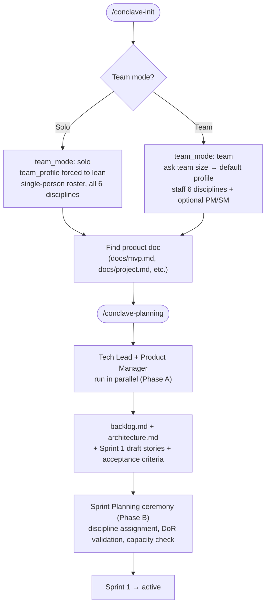
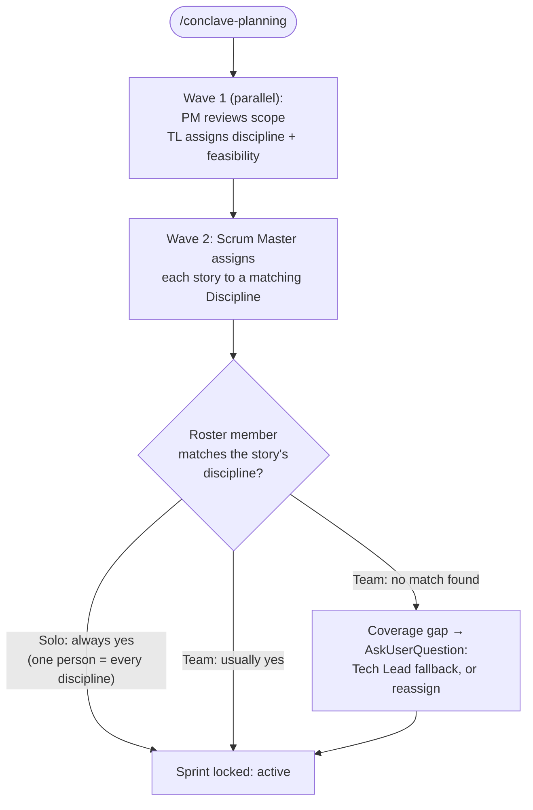
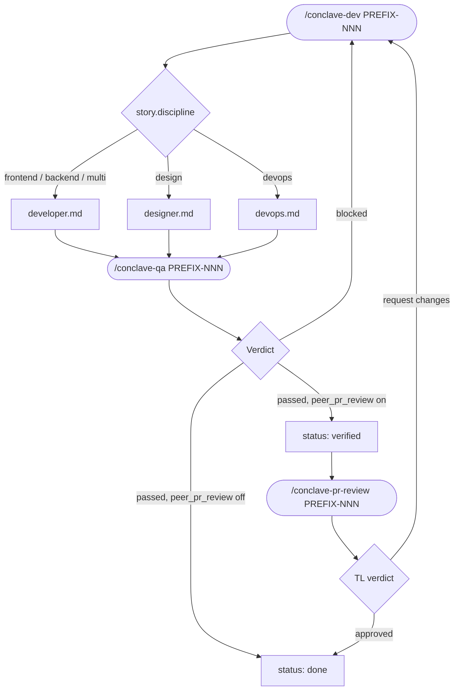

# Workflow map

Conclave runs the exact same commands whether you're solo or a team — what changes is how much each command asks, and how assignment works. This page maps the full loop end to end, branching where solo and team actually differ.

## Day 0 — bootstrap and founding artifacts

```mermaid
flowchart TD
    Start(["/conclave-init"]) --> Q{"Team mode?"}

    Q -->|Solo| SoloBranch["team_mode: solo<br/>team_profile forced to lean<br/>single-person roster, all 6 disciplines"]
    Q -->|Team| TeamBranch["team_mode: team<br/>ask team size → default profile<br/>staff 6 disciplines + optional PM/SM"]

    SoloBranch --> DocQ["Find product doc<br/>(docs/mvp.md, docs/project.md, etc.)"]
    TeamBranch --> DocQ

    DocQ --> Plan(["/conclave-planning"])
    Plan --> Parallel["Tech Lead + Product Manager<br/>run in parallel (Phase A)"]
    Parallel --> Artifacts["backlog.md + architecture.md<br/>+ Sprint 1 draft stories + acceptance criteria"]
    Artifacts --> Ceremony["Sprint Planning ceremony (Phase B)<br/>discipline assignment, DoR validation, capacity check"]
    Ceremony --> Active["Sprint 1 → active"]
```

Solo and team run the same `/conclave-planning` step — the branch only changes what `/conclave-init` asked and how `roster.md` looks.

Phase A (generation from the product document) runs only once — on the first call to `/conclave-planning` when no backlog exists yet. Subsequent calls skip directly to the planning ceremony (Phase B).

## Sprint Planning — where solo and team diverge most

```mermaid
flowchart TD
    Plan(["/conclave-planning"]) --> Wave1["Wave 1 (parallel):<br/>PM reviews scope<br/>TL assigns discipline + feasibility"]
    Wave1 --> Wave2["Wave 2: Scrum Master assigns<br/>each story to a matching Discipline"]

    Wave2 --> Match{"Roster member<br/>matches the story's<br/>discipline?"}

    Match -->|"Solo: always yes<br/>(one person = every discipline)"| Lock["Sprint locked: active"]
    Match -->|"Team: usually yes"| Lock
    Match -->|"Team: no match found"| Gap["Coverage gap →<br/>AskUserQuestion:<br/>Tech Lead fallback, or reassign"]
    Gap --> Lock
```

On a solo project, the discipline-match check in Wave 2 never produces a coverage gap. On a team, an unstaffed discipline (`TBD` in the roster) triggers the gap prompt.

## Per-story delivery loop — identical after that

```mermaid
flowchart TD
    Dev(["/conclave-dev PREFIX-NNN"]) --> Route{"story.discipline"}
    Route -->|frontend / backend / multi| Developer["developer.md"]
    Route -->|design| Designer["designer.md"]
    Route -->|devops| DevOps["devops.md"]

    Developer --> QA(["/conclave-qa PREFIX-NNN"])
    Designer --> QA
    DevOps --> QA

    QA --> Verdict{"Verdict"}
    Verdict -->|blocked| Dev
    Verdict -->|"passed, peer_pr_review off"| Done["status: done"]
    Verdict -->|"passed, peer_pr_review on"| Verified["status: verified"]

    Verified --> PRReview(["/conclave-pr-review PREFIX-NNN"])
    PRReview --> TLVerdict{"TL verdict"}
    TLVerdict -->|request changes| Dev
    TLVerdict -->|approved| Done
```

`peer_pr_review.required` is normally `false` in `lean` (the solo default), so a solo run typically skips `/conclave-pr-review` entirely — QA's pass goes straight to `done`.

## Solo vs. team, side by side

| Step | Solo | Team |
|---|---|---|
| `/conclave-init` questions | Project name, story prefix, language, launch date. No profile question — `lean` is forced. | Same, plus team size and one question per discipline to staff the roster. |
| Roster shape | One row, `Discipline` = all six, `Process role(s)` = PM, SM. | One row per discipline (or per person), `TBD` for anything unstaffed. |
| `/conclave-planning` Phase A | Identical — Tech Lead and Product Manager run as two separate agents even if one human does both jobs. | Identical. |
| `/conclave-planning` Wave 2 (assignment) | Always finds a match; coverage gaps cannot happen. | Can hit a coverage gap if a discipline is `TBD` or a story needs one nobody covers. |
| `/conclave-dev` discipline routing | Same routing table — the charter depends on the story, not on who's running it. | Identical. |
| `/conclave-pr-review` | Skipped by default (`peer_pr_review.required: false` under `lean`). QA's pass alone reaches `done`. | Runs when `peer_pr_review.required: true` (the `full-scrum` default). |

The takeaway: **the commands and the discipline model never change.** What changes is purely `config.md`'s `team_mode`, `team_profile`, and how many humans are behind the roster's rows.
