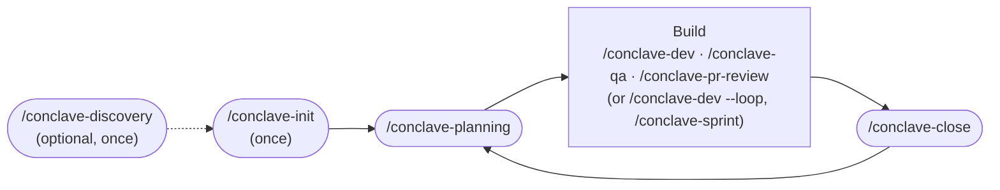
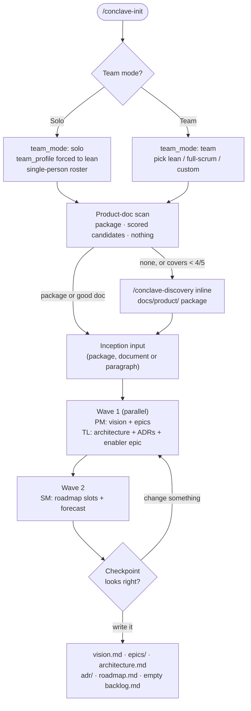
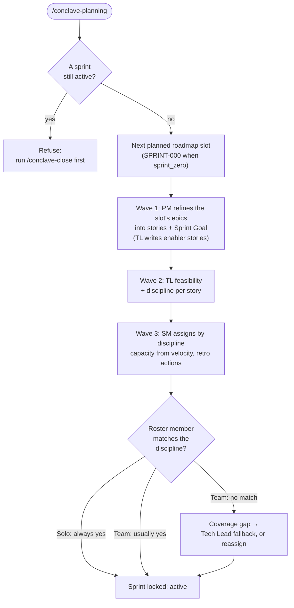
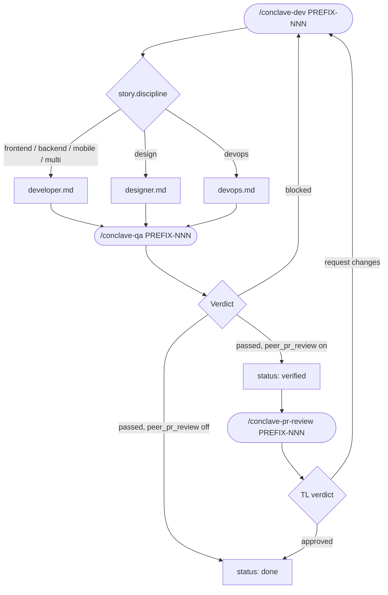
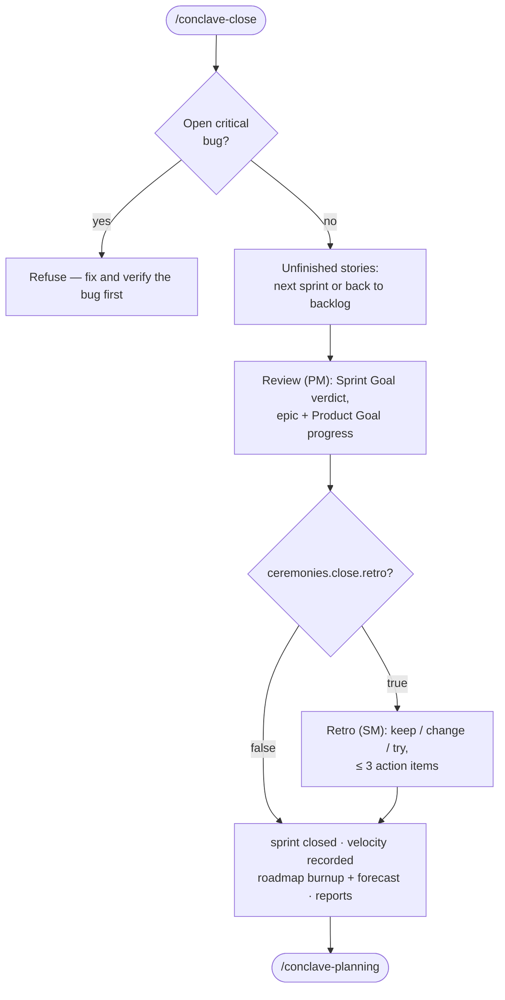

# Workflow map

Conclave runs the exact same commands whether you're solo or a team — what changes is how much each command asks, and how assignment works. This page maps the full cycle end to end, branching where solo and team actually differ.

## The cycle

```mermaid
flowchart LR
    Disc(["/conclave-discovery<br/>(optional, once)"]) -.-> Init
    Init(["/conclave-init<br/>(once)"]) --> Plan(["/conclave-planning"])
    Plan --> Build["Build<br/>/conclave-dev · /conclave-qa · /conclave-pr-review<br/>(or /conclave-dev --loop, /conclave-sprint)"]
    Build --> Close(["/conclave-close"])
    Close --> Plan
```

`/conclave-discovery` is optional: on a greenfield repo with no product document it writes the `docs/product/` package (discovery, tech stack, data model, BLOC, MVP) that inception reads. Run it yourself, or let `/conclave-init` offer it and run it inline.

There are no standup, grooming, review or retro commands: the board and story statuses are the daily view, refinement happens inside planning, and review + retro happen inside close.

## Day 0 — setup and inception

```mermaid
flowchart TD
    Start(["/conclave-init"]) --> Q{"Team mode?"}

    Q -->|Solo| SoloBranch["team_mode: solo<br/>team_profile forced to lean<br/>single-person roster"]
    Q -->|Team| TeamBranch["team_mode: team<br/>pick lean / full-scrum / custom"]

    SoloBranch --> Scan["Product-doc scan<br/>package · scored candidates · nothing"]
    TeamBranch --> Scan
    Scan -->|none, or covers < 4/5| Disc["/conclave-discovery inline<br/>docs/product/ package"]
    Scan -->|package or good doc| Idea["Inception input<br/>(package, document or paragraph)"]
    Disc --> Idea

    Idea --> Wave1["Wave 1 (parallel)<br/>PM: vision + epics<br/>TL: architecture + ADRs + enabler epic"]
    Wave1 --> Wave2["Wave 2<br/>SM: roadmap slots + forecast"]
    Wave2 --> Check{"Checkpoint<br/>looks right?"}
    Check -->|change something| Wave1
    Check -->|write it| Artifacts["vision.md · epics/ · architecture.md<br/>adr/ · roadmap.md · empty backlog.md"]
```

Solo and team run the same inception — the branch only changes what `/conclave-init` asked and how `roster.md` looks.

## Sprint Planning — one slot at a time

```mermaid
flowchart TD
    Plan(["/conclave-planning"]) --> Gate{"A sprint<br/>still active?"}
    Gate -->|yes| Refuse["Refuse:<br/>run /conclave-close first"]
    Gate -->|no| Slot["Next planned roadmap slot<br/>(SPRINT-000 when sprint_zero)"]
    Slot --> W1["Wave 1: PM refines the slot's epics<br/>into stories + Sprint Goal<br/>(TL writes enabler stories)"]
    W1 --> W2["Wave 2: TL feasibility<br/>+ discipline per story"]
    W2 --> W3["Wave 3: SM assigns by discipline<br/>capacity from velocity, retro actions"]
    W3 --> Match{"Roster member<br/>matches the<br/>discipline?"}
    Match -->|"Solo: always yes"| Lock["Sprint locked: active"]
    Match -->|"Team: usually yes"| Lock
    Match -->|"Team: no match"| Gap["Coverage gap →<br/>Tech Lead fallback, or reassign"]
    Gap --> Lock
```

On a solo project, the discipline-match check never produces a coverage gap. On a team, an unstaffed discipline (`TBD` in the roster) triggers the gap prompt.

## Per-story delivery loop

```mermaid
flowchart TD
    Dev(["/conclave-dev PREFIX-NNN"]) --> Route{"story.discipline"}
    Route -->|frontend / backend / mobile / multi| Developer["developer.md"]
    Route -->|design| Designer["designer.md"]
    Route -->|devops| DevOps["devops.md"]

    Developer --> QA(["/conclave-qa PREFIX-NNN"])
    Designer --> QA
    DevOps --> QA

    QA --> Verdict{"Verdict"}
    Verdict -->|blocked| Dev
    Verdict -->|"passed, peer_pr_review off"| Done["status: done"]
    Verdict -->|"passed, peer_pr_review on"| Verified["status: verified"]

    Verified --> PRReview(["/conclave-pr-review PREFIX-NNN"])
    PRReview --> TLVerdict{"TL verdict"}
    TLVerdict -->|request changes| Dev
    TLVerdict -->|approved| Done
```

`peer_pr_review.required` is `false` in `lean` (the solo default), so a solo run typically skips `/conclave-pr-review` — QA's pass goes straight to `done`.

## Closing the sprint

```mermaid
flowchart TD
    Close(["/conclave-close"]) --> Bugs{"Open critical<br/>bug?"}
    Bugs -->|yes| Stop["Refuse — fix and verify the bug first"]
    Bugs -->|no| Unfinished["Unfinished stories:<br/>next sprint or back to backlog"]
    Unfinished --> Review["Review (PM): Sprint Goal verdict,<br/>epic + Product Goal progress"]
    Review --> Retro{"ceremonies.close.retro?"}
    Retro -->|true| SM["Retro (SM): keep / change / try,<br/>≤ 3 action items"]
    Retro -->|false| Write
    SM --> Write["sprint closed · velocity recorded<br/>roadmap burnup + forecast · reports"]
    Write --> Next(["/conclave-planning"])
```

## Solo vs. team, side by side

| Step | Solo | Team |
|---|---|---|
| `/conclave-init` questions | Project name, story prefix, language, launch date, sprint length. No profile question — `lean` is forced. | Same, plus the team profile. |
| Roster shape | One row covering every discipline, `Process role(s)` = PM, SM. | One row per discipline (or per person), `TBD` for anything unstaffed. |
| Inception | Identical — PM, TL and SM run as separate agents even if one human does every job. | Identical. |
| `/conclave-planning` assignment | Always finds a match. | Can hit a coverage gap if a discipline is `TBD`. |
| `/conclave-pr-review` | Skipped by default (`lean`). QA's pass alone reaches `done`. | Runs when `peer_pr_review.required: true` (the `full-scrum` default). |
| `/conclave-close` | Review always; retro off by default (`lean`). | Review always; retro on in `full-scrum` — paste the team's answers. |

The takeaway: **the commands and the discipline model never change.** What changes is purely `config.md`'s `team_mode`, `team_profile`, and how many humans are behind the roster's rows.
