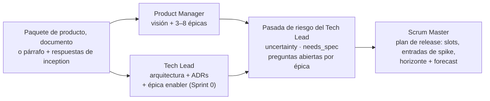

# /conclave-init [--upgrade]

Configuración única del proyecto **e inception**. Corré este comando **una vez por repositorio**, antes de `/conclave-planning`.

```
/conclave-init             # workspace nuevo: configuración + inception
/conclave-init --upgrade   # workspace v1.x existente: migrar a la estructura v2
```

Crea el workspace `conclave/`, registra la configuración que leen todos los demás comandos y produce los cuatro artefactos de los que cuelga el resto del ciclo Scrum:

| Artefacto | Dueño | Propósito |
|---|---|---|
| `product/vision.md` | Product Manager | Problema, personas, **Product Goal**, métricas de éxito, alcance del MVP |
| `product/epics/EP-NNN-<slug>.md` | Product Manager | Los grandes bloques de valor, cada uno con un criterio de éxito |
| `product/architecture.md` + `product/adr/` | Tech Lead | Base arquitectónica y los enablers que necesita el walking skeleton |
| `product/roadmap.md` | Scrum Master | Plan de release: cuántos sprints, épicas (y entradas de spike antes de las épicas riesgosas) secuenciadas en slots hasta el MVP / fecha de lanzamiento |

¿Todavía no hay documento de producto? El Paso 3 ofrece [`/conclave-discovery`](/es/commands/discovery) y lo corre inline — o corrélo vos antes.

**Acá no se escriben historias.** Se refinan just in time, un slot del roadmap a la vez, en [`/conclave-planning`](/es/commands/planning).

## Qué hace

### Paso 0 — Guardia de idempotencia y modo

Si `conclave/config.md` ya existe, el comando lee su `conclave_version`:

| Modo | Versión existente | Resultado |
|---|---|---|
| sin flag | `< 2.0.0` o ausente | Se detiene: corré `/conclave-init --upgrade` para migrar. |
| sin flag | `>= 2.0.0` | Se detiene: ya está inicializado — editá `config.md`, corré `/conclave-planning`. |
| `--upgrade` | `< 2.0.0` | Corre el [camino de upgrade](#camino-de-upgrade---upgrade). |
| `--upgrade` | `>= 2.0.0` | Se detiene: ya está en v2. |

`--upgrade` sin ningún `config.md` se detiene y te dice que corras `/conclave-init` sin el flag. Si el directorio actual no es un repo git, pregunta si correr `git init`.

### Paso 1 — Detectar el stack

Antes de preguntar nada, el comando escanea hasta 3 niveles de directorio buscando archivos señal:

| Archivo señal | Stack probable |
|---|---|
| `package.json` + `next.config.*` | Next.js |
| `package.json` (sin config de framework) | Node.js |
| `pubspec.yaml` | Flutter / Dart |
| `go.mod` | Go |
| `Cargo.toml` | Rust |
| `requirements.txt` / `pyproject.toml` | Python |
| `build.gradle` / `pom.xml` | Android / Java / Kotlin |
| `Gemfile` | Ruby on Rails |
| `mix.exs` | Elixir |
| `composer.json` | PHP |

### Paso 2 — Reunir info del proyecto

Una sola llamada a `AskUserQuestion` reúne:

1. **Nombre del proyecto** — el título en todos los artefactos generados.
2. **Prefijo de ID de historia** — default `US`. Las historias se llaman `<PREFIX>-001`, `<PREFIX>-002`, …
3. **Idioma del proyecto** — código ISO 639-1 (default `es`). Todo el markdown generado se escribe en ese idioma.
4. **Fecha de lanzamiento** — fecha ISO o `TBD`.
5. **Modo de equipo** — `team` o `solo` (solo fuerza `lean`).
6. **Perfil de equipo** (solo en modo team) — `lean` (gate del TL y retro apagados), `full-scrum` (gate de aprobación de PR del TL encendido, retro encendida dentro de `/conclave-close`) o `custom`.
7. **Duración del sprint** — 1, 2 (recomendado), 3 o 4 semanas. Se guarda como `sprint.length_weeks`.

### Paso 3 — Documentación de producto

La inception necesita saber qué es el producto, para quién y cuál es el MVP. Este paso encuentra la documentación de producto del equipo, chequea que cubra lo que la inception necesita y — si no hay ninguna — ofrece [`/conclave-discovery`](/es/commands/discovery) para escribirla. Un documento terminado es bienvenido pero **no es obligatorio**.

**3.1 — Escanear el repo (sin agente).** Primero busca un paquete de [`/conclave-discovery`](/es/commands/discovery): un `README.md` bajo un path `docs` con `conclave_product_package: true` en el frontmatter (default `docs/product/`). Un paquete le gana a todo lo demás. Si no hay, lista cada `.md` hasta profundidad 4 — excluyendo `.git/`, `node_modules/`, `vendor/`, `dist/`, `build/`, `conclave/`, `conclave-board/`, `.github/`, `site/` y `CHANGELOG.md`, `LICENSE*`, `CODE_OF_CONDUCT.md`, `CONTRIBUTING.md`, `SECURITY.md`, `CLAUDE.md` — y puntúa cada uno leyendo sus primeras ~200 líneas:

| Señal | Puntos |
|---|---|
| Bajo `docs/` (o `doc/`, `product/`) | +2 |
| El nombre contiene `mvp`, `product`, `prd`, `vision`, `discovery`, `brief`, `idea`, `project`, `spec`, `requirements` | +3 |
| Cada señal de cobertura presente (abajo) | +2 |
| `README.md` de la raíz | −2 (suele ser doc de instalación, no de producto) |

Las cinco **señales de cobertura** son lo que necesita la inception, buscadas en headings o párrafos obvios en inglés o español:

| Señal | Coincide con |
|---|---|
| Problema | problem, pain, problema, dolor |
| Usuarios | user, persona, ICP, customer, usuario, cliente |
| Objetivo / métricas | goal, objective, metric, KPI, success, objetivo, métrica, éxito |
| Features / alcance | feature, scope, functionality, funcionalidad, alcance, requisitos |
| Límite del MVP | MVP, out of scope, fuera de alcance, v1, release |

Se quedan los candidatos con puntaje ≥ 4, los 3 mejores, cada uno con sus señales faltantes.

**3.2 — Elegir la fuente.** Una pregunta, según lo que encontró el escaneo:

| Caso | Opciones |
|---|---|
| **A.** Se encontró un paquete de discovery | **Usarlo** (recomendado) · **Regenerarlo con /conclave-discovery** · **Usar otra cosa** |
| **B.** Se encontraron candidatos | Una opción por candidato (`<path>` — cubre N/5, faltan: …) · **Ninguno — escribirlo con /conclave-discovery** · **Describo la idea en un párrafo** |
| **C.** No se encontró nada | **Crearlo con /conclave-discovery** (recomendado; unos 10–15 minutos) · **Describo la idea en un párrafo** (más rápido, inception más flaca — el PM llena huecos y lista preguntas abiertas) · **Tengo un documento en otro lado** (un path, que se verifica que exista) |

**3.3 — Chequeo de huecos.** Un documento elegido que cubre **menos de 4 de las 5** señales recibe una pregunta más: **Completarlo con `/conclave-discovery --from <path>`** (recomendado — conserva todo lo que dice el documento, llena los huecos y escribe el paquete en `docs/product/`) o **Usarlo así** (el PM lista lo que falta como preguntas abiertas en `vision.md`).

**3.4 — Discovery inline.** Cuando alguna respuesta eligió `/conclave-discovery`, sus Pasos 1–7 corren acá mismo — con `--from` si se completa un documento, el idioma del proyecto del Paso 2 y el tamaño del equipo según el modo de equipo — y el control vuelve a init con el paquete nuevo como fuente.

**3.5 — Inputs.** El resultado define `product_doc_path`:

- **Paquete** → la carpeta del paquete; la inception lee los cinco documentos.
- **Documento** → su path; la inception lee su contenido.
- **Párrafo** → `""`; el texto que escribas se guarda tal cual en `conclave/context/idea.md`.

### Paso 4 — Confirmar el stack y las preferencias de inception

**4.1 — Stack.** Una pregunta muestra el stack (lenguaje, framework, datastore, infraestructura) con el origen de cada valor. Defaults, en orden: los archivos señal del Paso 1; si no se detectó nada, el frontmatter `stack:` del `01-tech-stack.md` del paquete ("from docs/product/01-tech-stack.md"). Si existen ambos y no coinciden, se muestran los dos y se recomienda el detectado — el código es el hecho. Confirmás o corregís por campo.

El Paso 1 también decide si el repo es **greenfield** (todavía sin código de aplicación): eso define el default de `sprint.sprint_zero` y le indica al Tech Lead que la arquitectura es una propuesta para un repo vacío.

**4.2 — Preferencias de inception.** Una ronda corta y opcional pregunta solo lo que la fuente no responde: usuarios principales, una pista del Product Goal, restricciones duras — las tres se saltean con un paquete de discovery — y si **arrancar con un Sprint 0 walking skeleton** (default sí en greenfield o cuando el `04-mvp.md` del paquete lista enablers de Sprint 0). Desde v2.0.0 también pregunta:

- **¿Cuántos sprints?** — **Auto — tantos como necesiten las épicas must/should** (default) o un número, contando el Sprint 0. Con una `launch_date`, se muestran como pista los sprints que entran antes de esa fecha. Un número fija el horizonte del release (`sprint.planned_sprints`): las épicas que no entran van a *Beyond the horizon* y el forecast nombra cualquier épica `must` que quede afuera. Se cambia después con [`/conclave-roadmap replan`](/es/commands/roadmap).
- **SPEC gate** — cuando una épica necesita una especificación técnica, ¿el planning debe **avisar** (`warn`) o **exigir** (`require`) una SPEC aprobada? Se guarda como `delivery.spec_gate` (`require` es el default para `full-scrum`).

### Paso 5 — Crear el esqueleto del workspace

Escribe `config.md`, `team/roster.md`, `team/ceremonies.md`, DoR/DoD, `conclave/README.md`, los templates de PR/issue de GitHub (solo si faltan) y los snapshots de contexto.

### Pasos 6–7 — Inception (tres subagentes de rol)



- **Ola 1 (en paralelo)** — el Product Manager escribe la visión y 3–8 épicas de feature ordenadas por valor (desde un paquete de discovery, las épicas candidatas de `04-mvp.md` *son* las épicas); el Tech Lead escribe la base arquitectónica, los ADRs iniciales y, si el Sprint 0 está activo, una épica enabler "Walking skeleton" (scaffold, framework de tests con un test que pasa, lint, CI, rama de integración `develop`). En greenfield, la evidencia de cada ADR sale de documentación versionada, y el ADR lo aclara. Desde un paquete de discovery, `01-tech-stack.md` es el punto de partida: cada elección se vuelve un ADR (sus alternativas descartadas pasan a ser las alternativas consideradas), y `02-data-model.md` / `03-bloc.md` alimentan el overview de la arquitectura.
- **Ola 1.5 — pasada de riesgo** (v2.0.0+) — el PM escribió las épicas sin ver la arquitectura; el TL escribió la arquitectura sin ver las épicas. Una llamada más al Tech Lead las une: para cada épica define `uncertainty` (`low | medium | high`), `needs_spec` (true cuando la épica cambia el modelo de datos, un contrato público, o más de un componente), los ADRs de los que depende, y 0–3 **preguntas abiertas** formuladas como decisiones (al menos una si es `high`). Esto queda en el frontmatter de la épica y en su sección `## Open questions (spike candidates)`. El alcance y la prioridad del PM no se tocan acá.
- **Ola 2** — el Scrum Master secuencia las épicas en slots de sprint usando el tamaño del equipo, la duración del sprint, la fecha de lanzamiento y el horizonte del Paso 4.2, e indica en qué slot cae el MVP. Cada épica `uncertainty: high` recibe una **entrada de spike** `spike:EP-NNN` en el slot anterior a su primer slot; las épicas que no entran en un horizonte fijo van a *Beyond the horizon*.

### Paso 8 — Checkpoint

Ves un resumen compacto antes de que se escriba nada:

```
Product Goal:  <una oración>
Personas:      <nombres>
Epics:         EP-001 <título> [M, must] · EP-002 <título> [S, should, uncertainty: high, needs SPEC] · …
Sprints:       <N> planned (<auto | fixed>) · Sprint 0: <yes/no> · beyond the horizon: <épicas o none>
Roadmap:       S0 walking skeleton · S1 EP-001, spike:EP-002 · S2 EP-001, EP-002 · … MVP at SPRINT-00N (<fecha>)
Spikes:        <n> scheduled — EP-002: "<primera pregunta abierta>"
ADRs:          ADR-001 <título> · ADR-002 <título> · …
Launch risk:   <on track | at risk — motivo>
```

Lo aceptás, o describís un cambio en texto libre: solo se vuelve a correr el agente afectado (la pasada de riesgo y el roadmap siempre se recalculan si cambian las épicas; un cambio en la cantidad de sprints vuelve a correr al SM). Después de tres rondas, el comando escribe lo que hay y te pide que edites los archivos a mano.

### Paso 9 — Escribir los artefactos de inception

Visión, épicas (numeradas desde `EP-001`, la enabler primero, con los campos de riesgo — la enabler es `uncertainty: low`, `needs_spec: false`), arquitectura y ADRs independientes, roadmap y un `product/backlog.md` **vacío** — las historias llegan en el planning.

## Qué crea

```
conclave/
├── README.md
├── config.md                         # proyecto, stack, perfil, cadencia de sprint
├── team/
│   ├── roster.md
│   ├── ceremonies.md
│   ├── PR_REVIEW_TEMPLATE.md
│   └── testing-environments.md
├── product/
│   ├── vision.md                     # Product Goal, personas, métricas de éxito, alcance del MVP
│   ├── roadmap.md                    # slots de sprint, burnup, forecast, log de re-planificación
│   ├── epics/EP-NNN-<slug>.md
│   ├── architecture.md
│   ├── adr/ADR-NNN-<slug>.md
│   ├── specs/                        # SPEC-NNN-<slug>.md — vacío hasta /conclave-spec (v2.0.0+)
│   ├── backlog.md                    # tabla vacía — la completa /conclave-planning
│   ├── definition-of-ready.md
│   └── definition-of-done.md
├── context/                          # snapshots (+ idea.md si la idea se escribió a mano)
├── sprints/
├── runs/
└── report/
.github/
├── ISSUE_TEMPLATE/bug_report.md      # solo si no existe
└── PULL_REQUEST_TEMPLATE.md          # solo si no existe
```

## Camino de upgrade (`--upgrade`)

Migra un workspace v1.x en el lugar. **Agregar, no pisar**: los sprints, historias, archivos de aceptación y reportes existentes nunca se reescriben más allá de los campos de frontmatter listados abajo, y no se borra ni se renombra nada. Cada sub-paso es idempotente, así que volver a correrlo después de una falla parcial retoma desde donde quedó.

1. **Inventario** — imprime sprints por estado, cantidad de historias y cantidad de ADRs inline.
2. **Config** — elimina `ceremonies.daily_standup`, `backlog_grooming`, `sprint_review`; mapea `sprint_retrospective.required` → `ceremonies.close.retro`; agrega `sprint.length_weeks` (desde `team/ceremonies.md`, default 2) y `sprint.sprint_zero: false`; setea `conclave_version: "2.0.0"`. Ves el diff y confirmás antes de que se escriba.
3. **Estado de sprints** — los `done` / `archived` de v1 pasan a `closed`; se agregan `slot`, `epics`, `committed_units`, `velocity` (suma de estimaciones de historias `done`), `sprint_goal_met`, `closed_at` donde falten.
4. **Inception desde lo que existe** — el Product Manager agrupa cada historia no retirada en exactamente una épica y escribe `vision.md`; el paso del Tech Lead se saltea (tu `architecture.md` queda como está) pero la pasada de riesgo corre sobre las épicas derivadas, así cada una recibe `uncertainty`, `needs_spec` y preguntas abiertas; el Scrum Master arma un roadmap donde los sprints cerrados son slots `closed`, el sprint activo es el slot `active`, y el burnup se siembra con las velocidades pasadas.
5. **Frontmatter de historias** — agrega `type: feature` y `epic: EP-NNN` donde falten. Nada más cambia.
6. **Backlog** — agrega la columna `Epic` y reemplaza la vieja sección `## Vision` por un link a `vision.md`.

Si `architecture.md` todavía tiene secciones inline `### ADR-NNN:`, corré [`/conclave-adr`](/es/commands/adr) una vez para migrarlas. Mirá [Actualizar desde v1](/es/upgrade) para el checklist completo.

## Guardrails

- Solo escribe dentro de `conclave/` y `.github/` (y solo los archivos de `.github/` que todavía no existen).
- Escribe la carpeta del paquete de discovery (default `docs/product/`) solo si elegiste `/conclave-discovery` en el Paso 3.
- No commitea ni crea ramas — la rama de integración es una historia enabler del Sprint 0.
- No escribe historias.
- Nunca pisa un `config.md` existente fuera de `--upgrade`.

## Después de correrlo

```bash
git add conclave/ .github/
git commit -m "conclave: inception for <project_name>"

# Opcional, antes de que llegue el slot de la épica:
/conclave-spec EP-NNN                  # especificación técnica de cada épica marcada needs_spec
/conclave-roadmap replan --sprints N   # cambiar cuántos sprints tiene el release

/conclave-planning      # planifica el primer slot (Sprint 0 si está activo)
```
