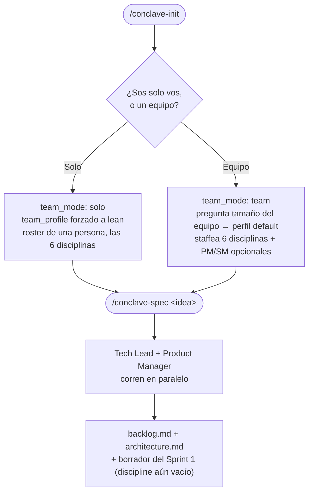
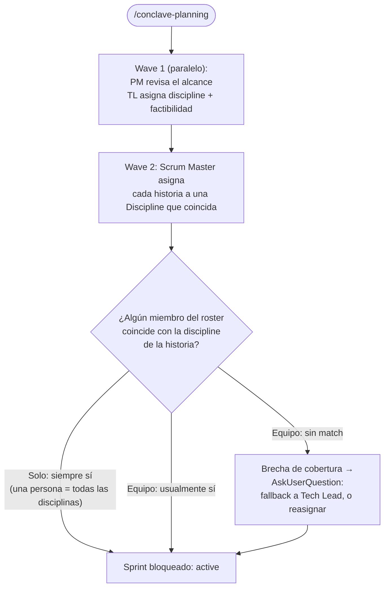
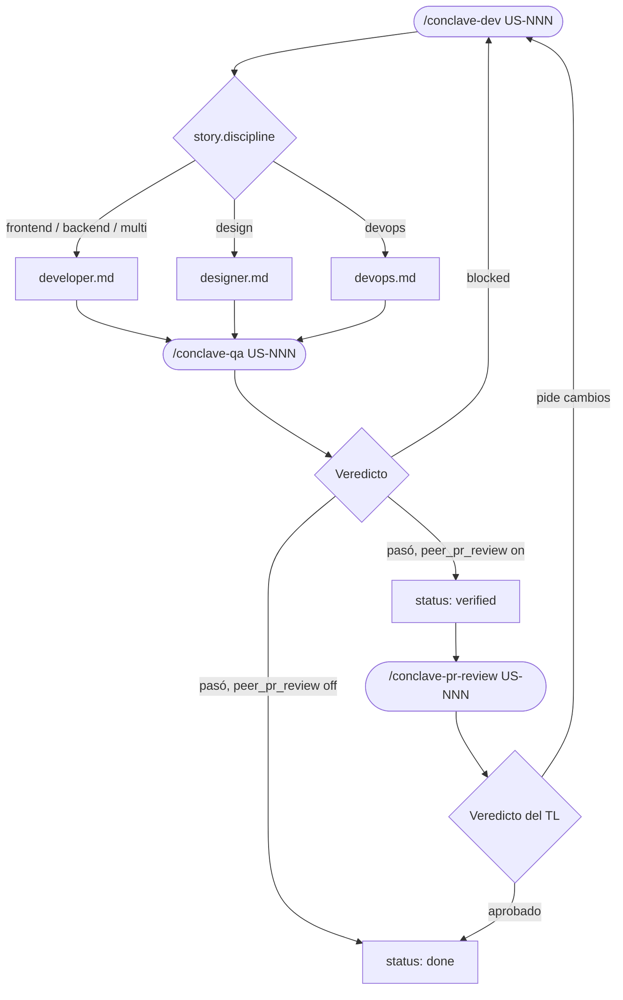

# Mapa de flujo

Conclave corre exactamente los mismos seis comandos ya sea que trabajes solo o en equipo — lo que cambia es cuánto pregunta cada comando, y cómo funciona la asignación. Esta página mapea el loop completo de punta a punta, bifurcando donde solo y equipo realmente difieren.

## Día 0 — bootstrap y artefactos fundacionales

Solo y equipo corren el mismo paso `/conclave-spec`, idéntico — la bifurcación solo cambia lo que preguntó `/conclave-init` y cómo queda `roster.md` después.

## Sprint Planning — donde solo y equipo más divergen

En un proyecto solo, el chequeo de match de discipline en Wave 2 nunca produce una brecha de cobertura — la única fila del roster lista todas las disciplinas, así que el Scrum Master siempre encuentra un match. En un equipo, una disciplina sin staffear (`TBD` en el roster) o una genuinamente descubierta dispara el prompt de brecha.

## El loop de entrega por historia — idéntico de ahí en adelante

`peer_pr_review.required` normalmente es `false` en `lean` (el default solo), así que una corrida solo típicamente se salta el paso `/conclave-pr-review` por completo — el pase de QA va directo a `done`. Un equipo en `full-scrum` siempre pasa por ambos gates.

## Solo vs. equipo, lado a lado

| Paso | Solo | Equipo |
|---|---|---|
| Preguntas de `/conclave-init` | Nombre del proyecto, tipo, largo del sprint, timezone. Sin pregunta de perfil — `lean` está forzado. | Igual, más el tamaño del equipo (define el perfil default), y una pregunta por disciplina para staffear el roster. |
| Forma del roster | Una fila, `Discipline` = las seis, `Process role(s)` = PM, SM. | Una fila por disciplina (o por persona, si alguien cubre varias), `TBD` en lo que no está staffeado. |
| `/conclave-spec` | Idéntico — Tech Lead y Product Manager siguen corriendo como dos subagentes separados en paralelo, aunque una persona humana esté haciendo ambos trabajos. | Idéntico. |
| `/conclave-planning` Wave 2 (asignación) | Siempre encuentra un match; las brechas de cobertura no pueden pasar. | Puede haber una brecha de cobertura si una disciplina está `TBD` o una historia necesita una que nadie cubre — se resuelve vía `AskUserQuestion`. |
| Ruteo por discipline en `/conclave-dev` | Misma tabla de ruteo (`developer.md` / `designer.md` / `devops.md`) — el charter que corre depende de la historia, no de quién la corre. | Idéntico. |
| `/conclave-pr-review` | Se salta por default (`peer_pr_review.required: false` bajo `lean`). El pase de QA solo llega a `done`. | Corre cuando `peer_pr_review.required: true` (el default de `full-scrum`) — un segundo gate, a nivel de código, antes de `done`. |

La conclusión: **los seis comandos y el modelo de disciplinas nunca cambian.** Lo que cambia es puramente los valores de `team_mode` y `team_profile` en `conclave/config.md`, y cuántas personas humanas hay detrás de las filas del roster.
