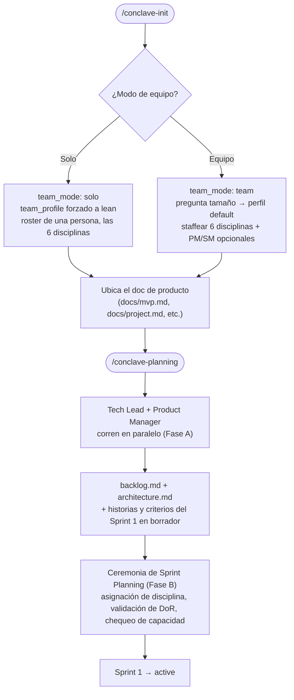
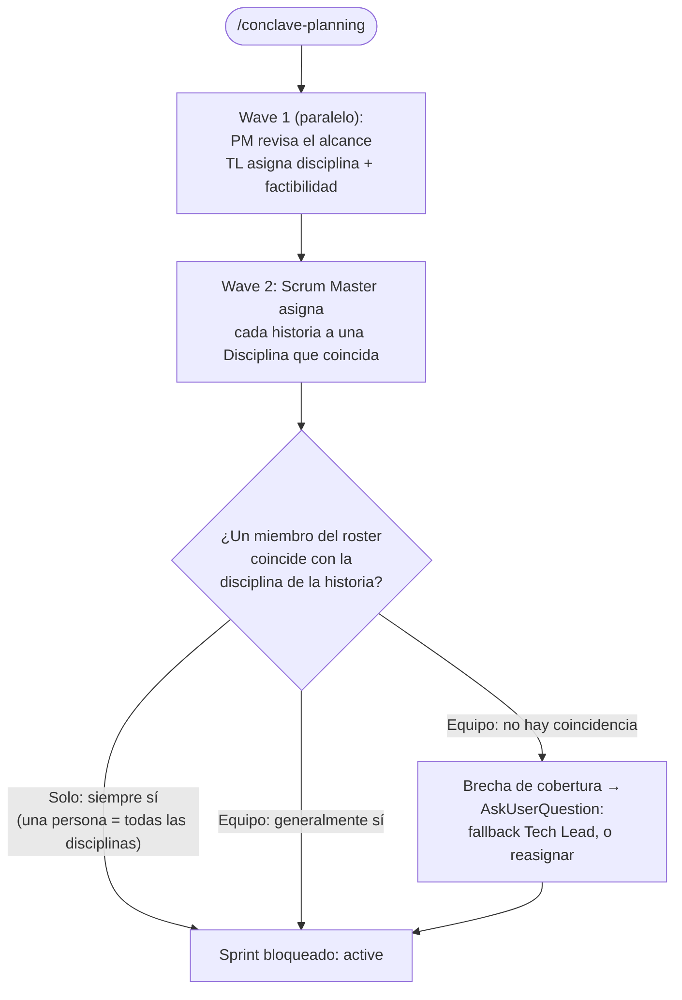
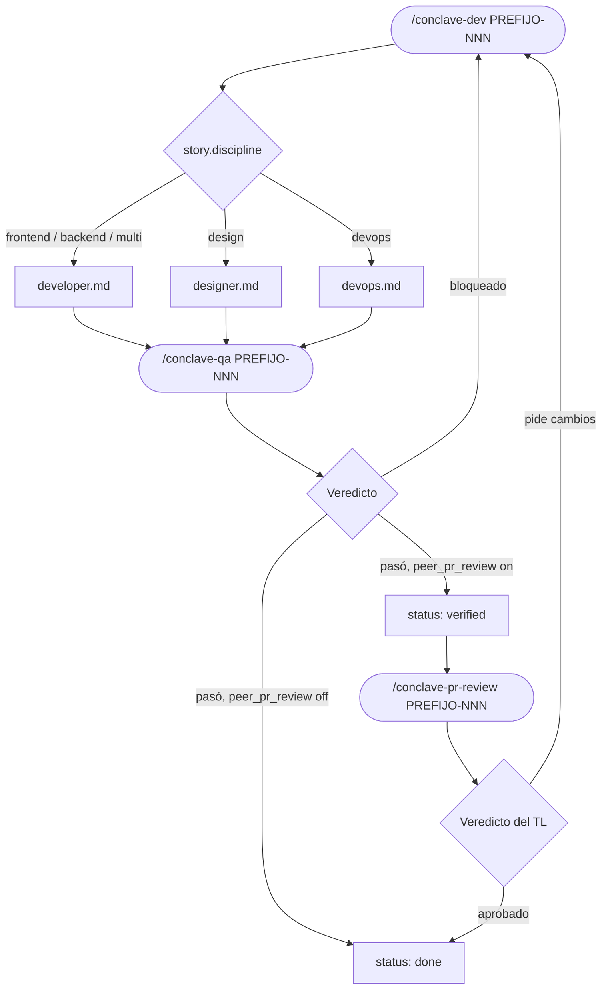

# Mapa de flujo de trabajo

Conclave corre exactamente los mismos comandos ya seas solo o en equipo — lo que cambia es cuánto pregunta cada comando y cómo funciona la asignación. Esta página mapea el loop completo de punta a punta, bifurcándose donde solo y equipo realmente difieren.

## Día 0 — bootstrap y artefactos fundacionales

```mermaid
flowchart TD
    Start(["/conclave-init"]) --> Q{"¿Modo de equipo?"}

    Q -->|Solo| SoloBranch["team_mode: solo<br/>team_profile forzado a lean<br/>roster de una persona, las 6 disciplinas"]
    Q -->|Equipo| TeamBranch["team_mode: team<br/>pregunta tamaño → perfil default<br/>staffear 6 disciplinas + PM/SM opcionales"]

    SoloBranch --> DocQ["Ubica el doc de producto<br/>(docs/mvp.md, docs/project.md, etc.)"]
    TeamBranch --> DocQ

    DocQ --> Plan(["/conclave-planning"])
    Plan --> Parallel["Tech Lead + Product Manager<br/>corren en paralelo (Fase A)"]
    Parallel --> Artifacts["backlog.md + architecture.md<br/>+ historias y criterios del Sprint 1 en borrador"]
    Artifacts --> Ceremony["Ceremonia de Sprint Planning (Fase B)<br/>asignación de disciplina, validación de DoR, chequeo de capacidad"]
    Ceremony --> Active["Sprint 1 → active"]
```

Solo y equipo corren el mismo paso de `/conclave-planning` — la bifurcación solo cambia lo que preguntó `/conclave-init` y cómo queda `roster.md`.

La Fase A (generación desde el documento de producto) corre solo una vez — en la primera llamada a `/conclave-planning` cuando no existe backlog todavía. Las llamadas posteriores saltan directamente a la ceremonia de planning (Fase B).

## Sprint Planning — donde solo y equipo divergen más

```mermaid
flowchart TD
    Plan(["/conclave-planning"]) --> Wave1["Wave 1 (paralelo):<br/>PM revisa el alcance<br/>TL asigna disciplina + factibilidad"]
    Wave1 --> Wave2["Wave 2: Scrum Master asigna<br/>cada historia a una Disciplina que coincida"]

    Wave2 --> Match{"¿Un miembro del roster<br/>coincide con la<br/>disciplina de la historia?"}

    Match -->|"Solo: siempre sí<br/>(una persona = todas las disciplinas)"| Lock["Sprint bloqueado: active"]
    Match -->|"Equipo: generalmente sí"| Lock
    Match -->|"Equipo: no hay coincidencia"| Gap["Brecha de cobertura →<br/>AskUserQuestion:<br/>fallback Tech Lead, o reasignar"]
    Gap --> Lock
```

En un proyecto solo, el chequeo de disciplina en Wave 2 nunca produce una brecha de cobertura. En un equipo, una disciplina sin staffear (`TBD` en el roster) dispara el prompt de brecha.

## Loop de entrega por historia — idéntico después de eso

```mermaid
flowchart TD
    Dev(["/conclave-dev PREFIJO-NNN"]) --> Route{"story.discipline"}
    Route -->|frontend / backend / multi| Developer["developer.md"]
    Route -->|design| Designer["designer.md"]
    Route -->|devops| DevOps["devops.md"]

    Developer --> QA(["/conclave-qa PREFIJO-NNN"])
    Designer --> QA
    DevOps --> QA

    QA --> Verdict{"Veredicto"}
    Verdict -->|bloqueado| Dev
    Verdict -->|"pasó, peer_pr_review off"| Done["status: done"]
    Verdict -->|"pasó, peer_pr_review on"| Verified["status: verified"]

    Verified --> PRReview(["/conclave-pr-review PREFIJO-NNN"])
    PRReview --> TLVerdict{"Veredicto del TL"}
    TLVerdict -->|pide cambios| Dev
    TLVerdict -->|aprobado| Done
```

`peer_pr_review.required` normalmente es `false` en `lean` (el default para solo), así que una corrida solo típicamente saltea `/conclave-pr-review` — el paso de QA va directamente a `done`.

## Solo vs. equipo, comparados

| Paso | Solo | Equipo |
|---|---|---|
| Preguntas de `/conclave-init` | Nombre del proyecto, prefijo de historia, idioma, fecha de lanzamiento. Sin pregunta de perfil — se fuerza `lean`. | Lo mismo, más tamaño del equipo y una pregunta por disciplina para staffear el roster. |
| Forma del roster | Una fila, `Discipline` = las seis, `Process role(s)` = PM, SM. | Una fila por disciplina (o por persona), `TBD` para lo que no está staffeado. |
| Fase A de `/conclave-planning` | Idéntica — Tech Lead y Product Manager corren como dos agentes separados aunque una sola persona haga los dos trabajos. | Idéntica. |
| Wave 2 de `/conclave-planning` (asignación) | Siempre encuentra coincidencia; las brechas de cobertura no pueden pasar. | Puede tener una brecha si una disciplina es `TBD` o una historia necesita una que nadie cubre. |
| Ruteo de disciplina de `/conclave-dev` | Misma tabla de ruteo — el charter depende de la historia, no de quién la corre. | Idéntico. |
| `/conclave-pr-review` | Salteado por default (`peer_pr_review.required: false` en `lean`). El paso de QA solo llega a `done`. | Corre cuando `peer_pr_review.required: true` (el default de `full-scrum`). |

La conclusión: **los comandos y el modelo de disciplinas nunca cambian.** Lo que cambia es puramente el `team_mode`, el `team_profile` de `config.md`, y cuántos humanos están detrás de las filas del roster.
