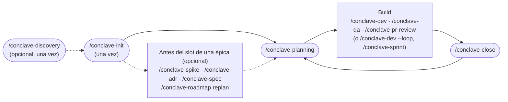
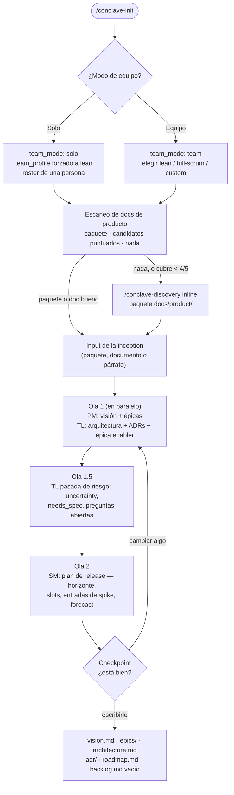
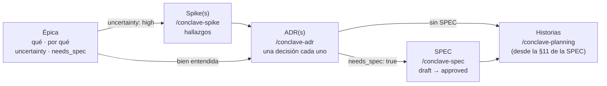
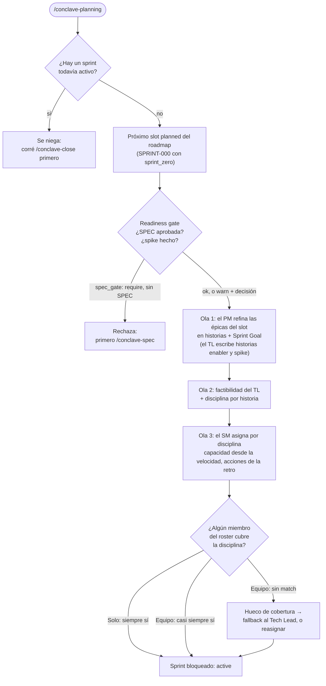
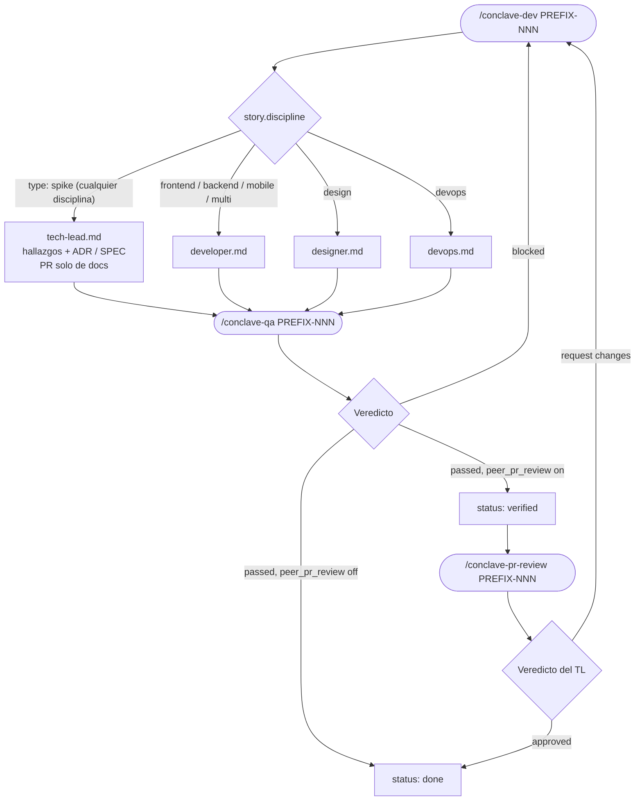
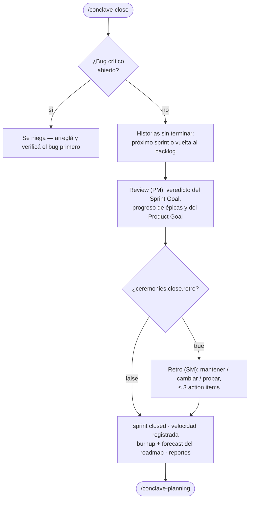

# Mapa de flujo

Conclave corre exactamente los mismos comandos si trabajás solo o en equipo — lo que cambia es cuánto pregunta cada comando y cómo funciona la asignación. Esta página mapea el ciclo completo de punta a punta, ramificando donde solo y equipo realmente difieren.

## El ciclo

```mermaid
flowchart LR
    Disc(["/conclave-discovery<br/>(opcional, una vez)"]) -.-> Init
    Init(["/conclave-init<br/>(una vez)"]) --> Plan(["/conclave-planning"])
    Init -.-> Design["Antes del slot de una épica (opcional)<br/>/conclave-spike · /conclave-adr · /conclave-spec<br/>/conclave-roadmap replan"]
    Design -.-> Plan
    Plan --> Build["Build<br/>/conclave-dev · /conclave-qa · /conclave-pr-review<br/>(o /conclave-dev --loop, /conclave-sprint)"]
    Build --> Close(["/conclave-close"])
    Close --> Plan
```

`/conclave-discovery` es opcional: en un repo greenfield sin documento de producto escribe el paquete `docs/product/` (discovery, tech stack, modelo de datos, BLOC, MVP) que lee la inception. Corrélo vos, o dejá que `/conclave-init` lo ofrezca y lo corra inline.

Entre la inception y el slot de una épica, el equipo puede bajarle el riesgo y diseñarla — ver [De la épica a las historias](#de-la-épica-a-las-historias) más abajo.

No hay comandos de standup, grooming, review ni retro: el board y los estados de las historias son la vista diaria, el refinamiento pasa dentro del planning, y review + retro pasan dentro del close.

## Día 0 — configuración e inception

```mermaid
flowchart TD
    Start(["/conclave-init"]) --> Q{"¿Modo de equipo?"}

    Q -->|Solo| SoloBranch["team_mode: solo<br/>team_profile forzado a lean<br/>roster de una persona"]
    Q -->|Equipo| TeamBranch["team_mode: team<br/>elegir lean / full-scrum / custom"]

    SoloBranch --> Scan["Escaneo de docs de producto<br/>paquete · candidatos puntuados · nada"]
    TeamBranch --> Scan
    Scan -->|nada, o cubre < 4/5| Disc["/conclave-discovery inline<br/>paquete docs/product/"]
    Scan -->|paquete o doc bueno| Idea["Input de la inception<br/>(paquete, documento o párrafo)"]
    Disc --> Idea

    Idea --> Wave1["Ola 1 (en paralelo)<br/>PM: visión + épicas<br/>TL: arquitectura + ADRs + épica enabler"]
    Wave1 --> Risk["Ola 1.5<br/>TL pasada de riesgo: uncertainty,<br/>needs_spec, preguntas abiertas"]
    Risk --> Wave2["Ola 2<br/>SM: plan de release — horizonte,<br/>slots, entradas de spike, forecast"]
    Wave2 --> Check{"Checkpoint<br/>¿está bien?"}
    Check -->|cambiar algo| Wave1
    Check -->|escribirlo| Artifacts["vision.md · epics/ · architecture.md<br/>adr/ · roadmap.md · backlog.md vacío"]
```

Solo y equipo corren la misma inception — la rama solo cambia lo que preguntó `/conclave-init` y cómo se ve `roster.md`.

La inception también decide **cuántos sprints** tiene el release: `auto` (tantos como necesiten las épicas `must`/`should`) o un número fijo, con lo que no entra listado en *Beyond the horizon*. Se vuelve a decidir en cualquier momento con [`/conclave-roadmap replan`](/es/commands/roadmap).

## De la épica a las historias

```mermaid
flowchart LR
    Epic["Épica<br/>qué · por qué<br/>uncertainty · needs_spec"] -->|"uncertainty: high"| Spike["Spike(s)<br/>/conclave-spike<br/>hallazgos"]
    Spike --> ADR["ADR(s)<br/>/conclave-adr<br/>una decisión cada uno"]
    Epic -->|bien entendida| ADR
    ADR -->|"needs_spec: true"| Spec["SPEC<br/>/conclave-spec<br/>draft → approved"]
    ADR -->|sin SPEC| Stories
    Spec --> Stories["Historias<br/>/conclave-planning<br/>(desde la §11 de la SPEC)"]
```

Cada paso es opcional para una épica bien entendida. Una entrada `spike:EP-NNN` del roadmap se vuelve una historia spike en el planning; un spike pasa por `/conclave-dev` → `/conclave-qa` como cualquier historia, pero lo ejecuta el Tech Lead y entrega un PR solo de docs.

## Sprint Planning — un slot a la vez

```mermaid
flowchart TD
    Plan(["/conclave-planning"]) --> Gate{"¿Hay un sprint<br/>todavía activo?"}
    Gate -->|sí| Refuse["Se niega:<br/>corré /conclave-close primero"]
    Gate -->|no| Slot["Próximo slot planned del roadmap<br/>(SPRINT-000 con sprint_zero)"]
    Slot --> Ready{"Readiness gate<br/>¿SPEC aprobada?<br/>¿spike hecho?"}
    Ready -->|"spec_gate: require, sin SPEC"| RefuseSpec["Rechaza:<br/>primero /conclave-spec"]
    Ready -->|"ok, o warn + decisión"| W1["Ola 1: el PM refina las épicas del slot<br/>en historias + Sprint Goal<br/>(el TL escribe historias enabler y spike)"]
    W1 --> W2["Ola 2: factibilidad del TL<br/>+ disciplina por historia"]
    W2 --> W3["Ola 3: el SM asigna por disciplina<br/>capacidad desde la velocidad, acciones de la retro"]
    W3 --> Match{"¿Algún miembro<br/>del roster cubre<br/>la disciplina?"}
    Match -->|"Solo: siempre sí"| Lock["Sprint bloqueado: active"]
    Match -->|"Equipo: casi siempre sí"| Lock
    Match -->|"Equipo: sin match"| Gap["Hueco de cobertura →<br/>fallback al Tech Lead, o reasignar"]
    Gap --> Lock
```

En un proyecto solo, el chequeo de disciplina nunca produce un hueco de cobertura. En un equipo, una disciplina sin cubrir (`TBD` en el roster) dispara la pregunta del hueco.

## Loop de entrega por historia

```mermaid
flowchart TD
    Dev(["/conclave-dev PREFIX-NNN"]) --> Route{"story.discipline"}
    Route -->|frontend / backend / mobile / multi| Developer["developer.md"]
    Route -->|design| Designer["designer.md"]
    Route -->|devops| DevOps["devops.md"]
    Route -->|"type: spike (cualquier disciplina)"| TLSpike["tech-lead.md<br/>hallazgos + ADR / SPEC<br/>PR solo de docs"]
    TLSpike --> QA

    Developer --> QA(["/conclave-qa PREFIX-NNN"])
    Designer --> QA
    DevOps --> QA

    QA --> Verdict{"Veredicto"}
    Verdict -->|blocked| Dev
    Verdict -->|"passed, peer_pr_review off"| Done["status: done"]
    Verdict -->|"passed, peer_pr_review on"| Verified["status: verified"]

    Verified --> PRReview(["/conclave-pr-review PREFIX-NNN"])
    PRReview --> TLVerdict{"Veredicto del TL"}
    TLVerdict -->|request changes| Dev
    TLVerdict -->|approved| Done
```

`peer_pr_review.required` es `false` en `lean` (el default para solo), así que una corrida solo normalmente se saltea `/conclave-pr-review` — el pass de QA va directo a `done`.

## Cierre del sprint

```mermaid
flowchart TD
    Close(["/conclave-close"]) --> Bugs{"¿Bug crítico<br/>abierto?"}
    Bugs -->|sí| Stop["Se niega — arreglá y verificá el bug primero"]
    Bugs -->|no| Unfinished["Historias sin terminar:<br/>próximo sprint o vuelta al backlog"]
    Unfinished --> Review["Review (PM): veredicto del Sprint Goal,<br/>progreso de épicas y del Product Goal"]
    Review --> Retro{"¿ceremonies.close.retro?"}
    Retro -->|true| SM["Retro (SM): mantener / cambiar / probar,<br/>≤ 3 action items"]
    Retro -->|false| Write
    SM --> Write["sprint closed · velocidad registrada<br/>burnup + forecast del roadmap · reportes"]
    Write --> Next(["/conclave-planning"])
```

## Solo vs. equipo, lado a lado

| Paso | Solo | Equipo |
|---|---|---|
| Preguntas de `/conclave-init` | Nombre del proyecto, prefijo de historia, idioma, fecha de lanzamiento, duración del sprint. Sin pregunta de perfil — se fuerza `lean`. | Lo mismo, más el perfil de equipo. |
| Forma del roster | Una fila que cubre todas las disciplinas, `Process role(s)` = PM, SM. | Una fila por disciplina (o por persona), `TBD` para lo que no está cubierto. |
| Inception | Idéntica — PM, TL y SM corren como agentes separados aunque una sola persona haga todos los trabajos. | Idéntica. |
| Asignación en `/conclave-planning` | Siempre encuentra match. | Puede encontrar un hueco de cobertura si una disciplina está en `TBD`. |
| `/conclave-pr-review` | Se saltea por default (`lean`). El pass de QA solo alcanza `done`. | Corre cuando `peer_pr_review.required: true` (el default de `full-scrum`). |
| `/conclave-close` | Review siempre; retro apagada por default (`lean`). | Review siempre; retro encendida en `full-scrum` — pegá las respuestas del equipo. |

La conclusión: **los comandos y el modelo de disciplinas nunca cambian.** Lo que cambia es solo `team_mode` y `team_profile` en `config.md`, y cuántas personas hay detrás de las filas del roster.
